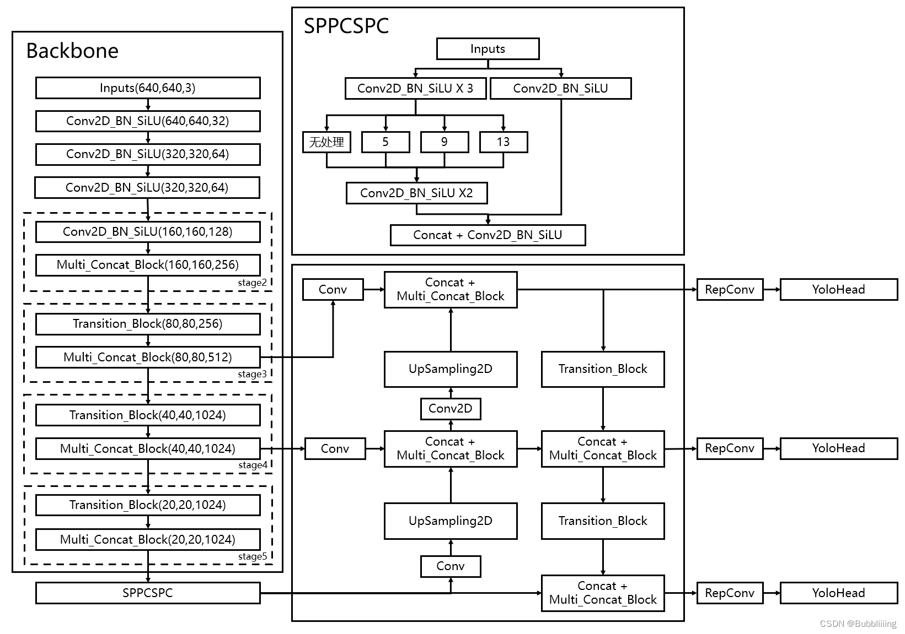
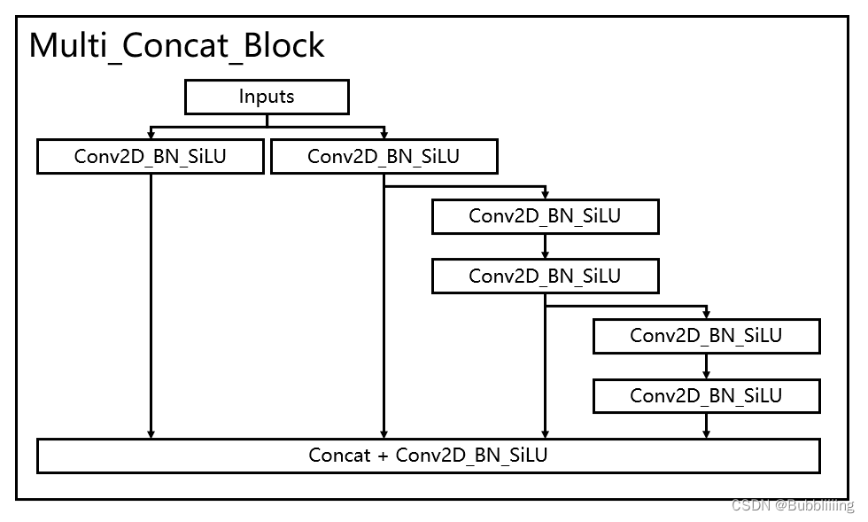
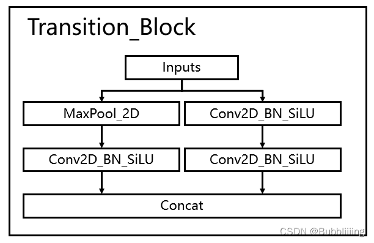
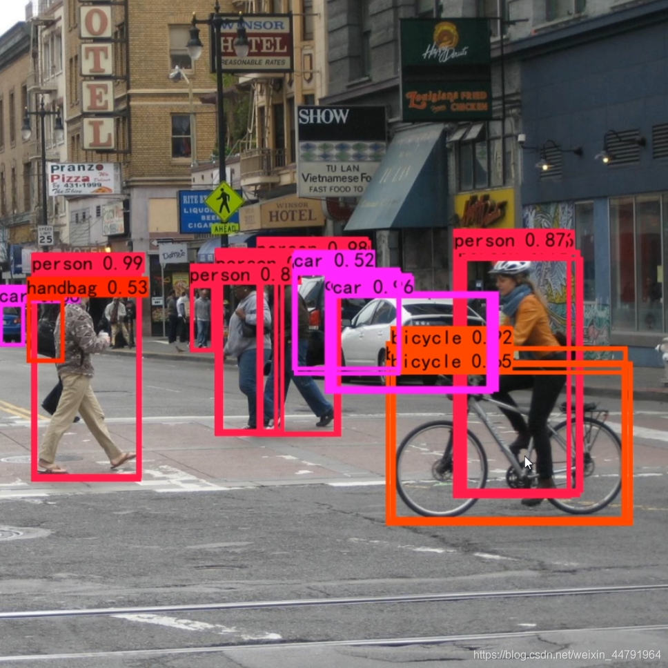
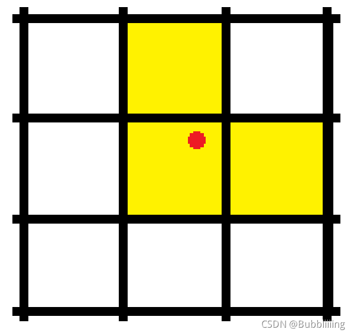

[睿智的目标检测61——Pytorch搭建YoloV7目标检测平台](https://blog.csdn.net/weixin_44791964/article/details/125827160)

# 源码下载

https://github.com/bubbliiiing/yolov7-pytorch

喜欢的可以点个star噢。

# YoloV7改进的部分（不完全）

1. **主干部分：使用了创新的多分支堆叠结构进行特征提取，相比以前的Yolo，模型的跳连接结构更加的密集。使用了创新的下采样结构，使用Maxpooling和步长为2x2的特征并行进行提取与压缩。**
2. **加强特征提取部分：同主干部分，加强特征提取部分也使用了多输入堆叠结构进行特征提取，使用Maxpooling和步长为2x2的特征并行进行下采样。**
3. **特殊的SPP结构：使用了具有CSP机构的SPP扩大感受野，在SPP结构中引入了CSP结构，该模块具有一个大的残差边辅助优化与特征提取。**
4. **自适应多正样本匹配：在YoloV5之前的Yolo系列里面，在训练时每一个真实框对应一个正样本，即在训练时，每一个真实框仅由一个先验框负责预测。YoloV7中为了加快模型的训练效率，增加了正样本的数量，在训练时，每一个真实框可以由多个先验框负责预测。除此之外，对于每个真实框，还会根据先验框调整后的预测框进行iou与种类的计算，获得cost，进而找到最适合该真实框的先验框。**

5. **借鉴了RepVGG的结构，在网络的特定部分引入RepConv，fuse后在保证网络x减少网络的参数量**
6. **使用了辅助分支辅助收敛，但是在模型较小的YoloV7和YoloV7-X中并没有使用。**

**以上并非全部的改进部分，还存在一些其它的改进，这里只列出来了一些我比较感兴趣，而且非常有效的改进。**

# YoloV7实现思路

## 一、整体结构解析



在学习YoloV7之前，我们需要对YoloV7所作的工作有一定的了解，这有助于我们后面去了解网络的细节，YoloV7在预测方式上与之前的Yolo并没有多大的差别，依然分为三个部分。

**分别是Backbone，FPN以及Yolo Head**。

**Backbone是YoloV7的主干特征提取网络**，输入的图片首先会在主干网络里面进行**特征提取**，提取到的特征可以被称作特征层，**是输入图片的特征集合**。在主干部分，我们**获取了三个特征层**进行下一步网络的构建，这三个特征层我称它为**有效特征层**。

**FPN是YoloV7的加强特征提取网络**，在主干部分获得的三个**有效特征层**会在这一部分进行特征融合，特征融合的目的是结合不同尺度的特征信息。在FPN部分，已经获得的**有效特征层**被用于继续提取特征。**在YoloV7里依然使用到了Panet的结构，我们不仅会对特征进行上采样实现特征融合，还会对特征再次进行下采样实现特征融合。**

**Yolo Head是YoloV7的分类器与回归器**，通过Backbone和FPN，我们已经可以获得三个加强过的有效特征层。每一个特征层都有宽、高和通道数，此时我们可以将**特征图看作一个又一个特征点的集合**，每个特征点上有三个先验框，**每一个先验框都有通道数个特征**。Yolo Head实际上所做的工作就是**对特征点进行判断**，判断**特征点上的先验框是否有物体与其对应**。与以前版本的Yolo一样，YoloV7所用的解耦头是一起的，也就是分类和回归在一个1X1卷积里实现。

因此，整个YoloV7网络所作的工作就是 **特征提取-特征加强-预测先验框对应的物体情况**。

## 二、网络结构解析

### 1、主干网络Backbone介绍


YoloV7所使用的主干特征提取网络具有两个重要特点：

1. 使用了**多分支堆叠模块**，这个模块其实论文里没有命名，但是我在分析源码后认为这个名字非常合适，在本博文中，多分支堆叠模块如图所示。

看了这幅图大家应该明白为什么我把这个模块称为多分支堆叠模块，因为在该模块中，最终堆叠模块的输入包含多个分支，**左一为一个卷积标准化激活函数，左二为一个卷积标准化激活函数，右二为三个卷积标准化激活函数，右一为五个卷积标准化激活函数。**

四个特征层在堆叠后会再次进行一个卷积标准化激活函数来特征整合。



```python
#-----------------------------------------------#
#   dark2,dark3,dark4,dark5的block
#                   in
#                   │
#          ┌────────┤
#       cv1(1x1) cv2(1x1)
#          │        ├─────────┐
#          │        │     cv3(3x3)_1
#          │        │         │
#          │        │     cv3(3x3)_2
#          │        │         ├─────────┐
#          │        │         │     cv3(3x3)_3
#          │        │         │         │
#          │        │         │     cv3(3x3)_4
#          │        │         │         ├ ─ ─ ─ ─ ┐
#          │        │         │         │      cv3(3x3)_N cv3会有多个卷积,多个输出
#          └────────┼─────────┴─────────┘─ ─ ─ ─ ─┘
#                concat
#                   │
#                cv4(1X1)
#                   │
#                  out
#-----------------------------------------------#
class Multi_Concat_Block(nn.Module):
    def __init__(self, c1, c2, c3, n=4, e=1, ids=[0]):
        super(Multi_Concat_Block, self).__init__()
        c_ = int(c2 * e)

        self.ids = ids
        #-----------------------------------------------#
        #   cv1,cv2和cv3的全部输出都会被保留下来
        #   cv1是一个单独输出,类似于CSP的短接分支
        #   cv2和cv3是串联在一起的
        #-----------------------------------------------#
        self.cv1 = Conv(c1, c_, 1, 1)
        self.cv2 = Conv(c1, c_, 1, 1)
        self.cv3 = nn.ModuleList(
            [Conv(c_ if i == 0 else c2, c2, 3, 1) for i in range(n)]
        )
        #-----------------------------------------------#
        #   cv1和cv2以及cv3的输出会被返回
        #   len(ids) - 2 是因为ids包括了cv1和cv2的输出
        #-----------------------------------------------#
        self.cv4 = Conv(c_ * 2 + c2 * (len(ids) - 2), c3, 1, 1)

    def forward(self, x):
        x_1 = self.cv1(x)
        x_2 = self.cv2(x)

        x_all = [x_1, x_2]
        for i in range(len(self.cv3)):
            x_2 = self.cv3[i](x_2)
            x_all.append(x_2)
        #-----------------------------------------------#
        #   cv1和cv2以及cv3的输出会被返回
        #-----------------------------------------------#
        out = self.cv4(torch.cat([x_all[id] for id in self.ids], 1))
        return out
```

如此多的堆叠其实也对应了更密集的残差结构，残差网络的特点是**容易优化**，并且能够通过增加相当的**深度来提高准确率**。其内部的**残差块使用了跳跃连接，缓解了在深度神经网络中增加深度带来的梯度消失问题。**

2. 使用创新的过渡模块Transition_Block来进行下采样，在卷积神经网络中，常见的用于下采样的过渡模块是**一个卷积核大小为3x3、步长为2x2的卷积**或者**一个步长为2x2的最大池化**。

两种过渡模块进行了集合，一个过渡模块存在两个分支，如图所示。左分支是一个步长为2x2的最大池化+一个1x1卷积，右分支是一个1x1卷积+一个卷积核大小为3x3、步长为2x2的卷积，两个分支的结果在输出时会进行堆叠。



```python
#-----------------------------------------------#
#   MaxPool2d k=2 s=2
#-----------------------------------------------#
class MP(nn.Module):
    def __init__(self, k=2):
        super(MP, self).__init__()
        self.m = nn.MaxPool2d(kernel_size=k, stride=k)

    def forward(self, x):
        return self.m(x)


#-----------------------------------------------#
#   dark3,dark4,dark5的下采样部分, 通道不变,宽高减半(针对backbone)
#   分支1 MaxPool2d + Conv
#   分支2 Conv      + Conv
#   最后将2个分支拼接返回
#-----------------------------------------------#
class Transition_Block(nn.Module):
    def __init__(self, c1, c2):
        super(Transition_Block, self).__init__()

        self.mp  = MP()
        self.cv1 = Conv(c1, c2, 1, 1)
        # 分支2,通道减半(针对backbone)
        self.cv2 = Conv(c1, c2, 1, 1)
        self.cv3 = Conv(c2, c2, 3, 2)   # s=2

    def forward(self, x):
        x_1 = self.mp(x)
        x_1 = self.cv1(x_1)

        x_2 = self.cv2(x)
        x_2 = self.cv3(x_2)

        # 两个通道减半拼接到一起最终通道不变
        return torch.cat([x_2, x_1], 1)
```

整个主干实现代码为：

```python
import torch
import torch.nn as nn


#-----------------#
#   Conv的padding
#-----------------#
def autopad(k, p=None):
    if p is None:
        p = k // 2 if isinstance(k, int) else [x // 2 for x in k]
    return p


class SiLU(nn.Module):
    @staticmethod
    def forward(x):
        return x * torch.sigmoid(x)


#-----------------#
#   Conv+BN+SiLU
#-----------------#
class Conv(nn.Module):
    def __init__(self, c1, c2, k=1, s=1, p=None, g=1, act=SiLU()):  # ch_in, ch_out, kernel, stride, padding, groups
        super(Conv, self).__init__()
        self.conv   = nn.Conv2d(c1, c2, k, s, autopad(k, p), groups=g, bias=False)
        self.bn     = nn.BatchNorm2d(c2, eps=0.001, momentum=0.03)
        self.act    = nn.LeakyReLU(0.1, inplace=True) if act is True else (act if isinstance(act, nn.Module) else nn.Identity())

    #---------#
    #   训练
    #---------#
    def forward(self, x):
        return self.act(self.bn(self.conv(x)))

    #-------------------------#
    #   推理过程,bn融合进卷积
    #-------------------------#
    def fuseforward(self, x):
        return self.act(self.conv(x))


#-----------------------------------------------#
#   dark2,dark3,dark4,dark5的block
#                   in
#                   │
#          ┌────────┤
#       cv1(1x1) cv2(1x1)
#          │        ├─────────┐
#          │        │     cv3(3x3)_1
#          │        │         │
#          │        │     cv3(3x3)_2
#          │        │         ├─────────┐
#          │        │         │     cv3(3x3)_3
#          │        │         │         │
#          │        │         │     cv3(3x3)_4
#          │        │         │         ├ ─ ─ ─ ─ ┐
#          │        │         │         │      cv3(3x3)_N cv3会有多个卷积,多个输出
#          └────────┼─────────┴─────────┘─ ─ ─ ─ ─┘
#                concat
#                   │
#                cv4(1X1)
#                   │
#                  out
#-----------------------------------------------#
class Multi_Concat_Block(nn.Module):
    def __init__(self, c1, c2, c3, n=4, e=1, ids=[0]):
        super(Multi_Concat_Block, self).__init__()
        c_ = int(c2 * e)

        self.ids = ids
        #-----------------------------------------------#
        #   cv1,cv2和cv3的全部输出都会被保留下来
        #   cv1是一个单独输出,类似于CSP的短接分支
        #   cv2和cv3是串联在一起的
        #-----------------------------------------------#
        self.cv1 = Conv(c1, c_, 1, 1)
        self.cv2 = Conv(c1, c_, 1, 1)
        self.cv3 = nn.ModuleList(
            [Conv(c_ if i == 0 else c2, c2, 3, 1) for i in range(n)]
        )
        #-----------------------------------------------#
        #   cv1和cv2以及cv3的输出会被返回
        #   len(ids) - 2 是因为ids包括了cv1和cv2的输出
        #-----------------------------------------------#
        self.cv4 = Conv(c_ * 2 + c2 * (len(ids) - 2), c3, 1, 1)

    def forward(self, x):
        x_1 = self.cv1(x)
        x_2 = self.cv2(x)

        x_all = [x_1, x_2]
        for i in range(len(self.cv3)):
            x_2 = self.cv3[i](x_2)
            x_all.append(x_2)
        #-----------------------------------------------#
        #   cv1和cv2以及cv3的输出会被返回
        #-----------------------------------------------#
        out = self.cv4(torch.cat([x_all[id] for id in self.ids], 1))
        return out


#-----------------------------------------------#
#   MaxPool2d k=2 s=2
#-----------------------------------------------#
class MP(nn.Module):
    def __init__(self, k=2):
        super(MP, self).__init__()
        self.m = nn.MaxPool2d(kernel_size=k, stride=k)

    def forward(self, x):
        return self.m(x)


#-----------------------------------------------#
#   dark3,dark4,dark5的下采样部分, 通道不变,宽高减半(针对backbone)
#   分支1 MaxPool2d + Conv
#   分支2 Conv      + Conv
#   最后将2个分支拼接返回
#-----------------------------------------------#
class Transition_Block(nn.Module):
    def __init__(self, c1, c2):
        super(Transition_Block, self).__init__()

        self.mp  = MP()
        self.cv1 = Conv(c1, c2, 1, 1)
        # 分支2,通道减半(针对backbone)
        self.cv2 = Conv(c1, c2, 1, 1)
        self.cv3 = Conv(c2, c2, 3, 2)   # s=2

    def forward(self, x):
        x_1 = self.mp(x)
        x_1 = self.cv1(x_1)

        x_2 = self.cv2(x)
        x_2 = self.cv3(x_2)

        # 两个通道减半拼接到一起最终通道不变
        return torch.cat([x_2, x_1], 1)


class Backbone(nn.Module):
    def __init__(self, transition_channels, block_channels, n, phi, pretrained=False):
        super().__init__()
        #-----------------------------------------------#
        #   输入图片是640, 640, 3
        #-----------------------------------------------#
        #-----------------------------------------------#
        #   dark中的Block中的返回id数
        #   最后两个代表cv1和cv2的输出,前2(3)个代表cv3的返回
        #-----------------------------------------------#
        ids = {
            'l' : [-1, -3, -5, -6],
            'x' : [-1, -3, -5, -7, -8],
        }[phi]
        #   [1, 3, 640, 640] -> [1, 64, 320, 320]
        self.stem = nn.Sequential(
            Conv(3, transition_channels, 3, 1),
            Conv(transition_channels, transition_channels * 2, 3, 2),       # s=2
            Conv(transition_channels * 2, transition_channels * 2, 3, 1),
        )
        #   [1, 64, 320, 320] -> [1, 256, 160, 160]
        self.dark2 = nn.Sequential(
            Conv(transition_channels * 2, transition_channels * 4, 3, 2),   # s=2
            Multi_Concat_Block(transition_channels * 4, block_channels * 2, transition_channels * 8, n=n, ids=ids),
        )
        #   [1, 256, 160, 160] -> [1, 512, 80, 80]
        #   Transition这里的参数2是两个分支的输出channel,最后拼接到一起通道和输入时相同
        self.dark3 = nn.Sequential(
            Transition_Block(transition_channels * 8, transition_channels * 4),
            Multi_Concat_Block(transition_channels * 8, block_channels * 4, transition_channels * 16, n=n, ids=ids),
        )
        #   [1, 512, 80, 80] -> [1, 1024, 40, 40]
        self.dark4 = nn.Sequential(
            Transition_Block(transition_channels * 16, transition_channels * 8),
            Multi_Concat_Block(transition_channels * 16, block_channels * 8, transition_channels * 32, n=n, ids=ids),
        )
        #   [1, 1024, 40, 40] -> [1, 1024, 20, 20]
        self.dark5 = nn.Sequential(
            Transition_Block(transition_channels * 32, transition_channels * 16),
            Multi_Concat_Block(transition_channels * 32, block_channels * 8, transition_channels * 32, n=n, ids=ids),
        )

        if pretrained:
            url = {
                "l" : 'https://github.com/bubbliiiing/yolov7-pytorch/releases/download/v1.0/yolov7_backbone_weights.pth',
                "x" : 'https://github.com/bubbliiiing/yolov7-pytorch/releases/download/v1.0/yolov7_x_backbone_weights.pth',
            }[phi]
            checkpoint = torch.hub.load_state_dict_from_url(url=url, map_location="cpu", model_dir="./model_data")
            self.load_state_dict(checkpoint, strict=False)
            print("Load weights from " + url.split('/')[-1])

    def forward(self, x):
        #-----------------------------------------------#
        #   [1, 3, 640, 640] -> [1, 64, 320, 320]
        #-----------------------------------------------#
        x = self.stem(x)
        #-----------------------------------------------#
        #   [1, 64, 320, 320] -> [1, 256, 160, 160]
        #-----------------------------------------------#
        x = self.dark2(x)
        #-----------------------------------------------#
        #   [1, 256, 160, 160] -> [1, 512, 80, 80]
        #   dark3的输出，是一个有效特征层
        #-----------------------------------------------#
        x = self.dark3(x)
        feat1 = x
        #-----------------------------------------------#
        #   [1, 512, 80, 80] -> [1, 1024, 40, 40]
        #   dark4的输出，是一个有效特征层
        #-----------------------------------------------#
        x = self.dark4(x)
        feat2 = x
        #-----------------------------------------------#
        #   [1, 1024, 40, 40] -> [1, 1024, 20, 20]
        #   dark5的输出，是一个有效特征层
        #-----------------------------------------------#
        x = self.dark5(x)
        feat3 = x
        return feat1, feat2, feat3


if __name__ == "__main__":
    phi                 = 'l'
    transition_channels = {'l' : 32, 'x' : 40}[phi]
    block_channels      = 32
    n                   = {'l' : 4, 'x' : 6}[phi]
    pretrained          = False
    backbone = Backbone(transition_channels, block_channels, n, phi, pretrained=pretrained)
    x = torch.randn(1, 3, 640, 640)
    backbone.eval()
    feat1, feat2, feat3 = backbone(x)
    print(feat1.size())     # [1,  512, 80, 80]
    print(feat2.size())     # [1, 1024, 40, 40]
    print(feat3.size())     # [1, 1024, 20, 20]

    if False:
        onnx_path = "./model_data/yolov7_backbone.onnx"
        torch.onnx.export(backbone,                     # 保存的模型
                            x,                          # 模型输入
                            onnx_path,                  # 模型保存 (can be a file or file-like object)
                            export_params=True,         # 如果指定为True或默认, 参数也会被导出. 如果你要导出一个没训练过的就设为 False.
                            verbose=False,              # 如果为True，则打印一些转换日志，并且onnx模型中会包含doc_string信息
                            opset_version=15,           # ONNX version 值必须等于_onnx_main_opset或在_onnx_stable_opsets之内。具体可在torch/onnx/symbolic_helper.py中找到
                            do_constant_folding=True,   # 是否使用“常量折叠”优化。常量折叠将使用一些算好的常量来优化一些输入全为常量的节点。
                            input_names=["input"],      # 按顺序分配给onnx图的输入节点的名称列表
                            output_names=["feat1", "feat2", "feat3"],    # 按顺序分配给onnx图的输出节点的名称列表
                            dynamic_axes={"input": {0: "batch_size"},   # 动态
                                        "output": {0: "batch_size"}})

        import onnx
        from onnxsim import simplify
        # 载入onnx模块
        model_ = onnx.load(onnx_path)
        # print(model_)

        # 简化模型,更好看
        model_simp, check = simplify(model_)
        assert check, "Simplified ONNX model could not be validated"
        onnx.save(model_simp, onnx_path)
        print('finished exporting onnx')

        # 检查IR是否良好
        try:
            onnx.checker.check_model(model_)
        except Exception:
            print("Model incorrect")
        else:
            print("Model correct")

        # Transition 通道不变,宽高减半
        # trans = Transition(64, 32)
        # x = torch.randn(1, 64, 256, 256)
        # y = trans(x)
        # print(y.size()) # [1, 64, 128, 128]
```

### 2、构建FPN特征金字塔进行加强特征提取


在特征利用部分，YoloV7提取**多特征层进行目标检测**，一共**提取三个特征层**。

三个特征层位于主干部分的不同位置，分别位于**中间层，中下层，底层**，当输入为(640,640,3)的时候，三个特征层的**shape分别为feat1=(80,80,256)、feat2=(40,40,512)、feat3=(20,20,1024)。**

在获得三个有效特征层后，我们利用这三个有效特征层进行FPN层的构建，构建方式为（在本博文中，将SPPCSPC结构归于FPN中）：

1. feat3=(20,20,1024)的特征层首先利用SPPCSPC进行特征提取，该结构可以提高YoloV7的感受野，获得P5。
2. 对P5先进行1次1X1卷积调整通道，**然后进行上采样UmSampling2d后与feat2=(40,40,512)进行一次卷积后的特征层进行结合**，然后使用Multi_Concat_Block进行特征提取获得P4，此时获得的特征层为(40,40,512)。
3. 对P4先进行1次1X1卷积调整通道，**然后进行上采样UmSampling2d后与feat1=(80,80,256)进行一次卷积后的特征层进行结合**，然后使用Multi_Concat_Block进行特征提取获得P3_out，此时获得的特征层为(80,80,256)。
4. P3_out=(80,80,256)的特征层进行一次Transition_Block卷积进行下采样，**下采样后与P4堆叠**，然后使用Multi_Concat_Block进行特征提取P4_out，此时获得的特征层为(40,40,512)。
5. P4_out=(40,40,512)的特征层进行一次Transition_Block卷积进行下采样，**下采样后与P5堆叠**，然后使用Multi_Concat_Block进行特征提取P5_out，此时获得的特征层为(20,20,1024)。

特征金字塔可以将**不同shape的特征层进行特征融合**，有利于**提取出更好的特征**。

```python
#---------------------------------------------------#
#   yolo_body
#---------------------------------------------------#
class YoloBody(nn.Module):
    def __init__(self, anchors_mask, num_classes, phi, pretrained=False):
        super(YoloBody, self).__init__()
        #-----------------------------------------------#
        #   定义了不同yolov7版本的参数
        #-----------------------------------------------#
        transition_channels = {'l' : 32, 'x' : 40}[phi]
        block_channels      = 32
        panet_channels      = {'l' : 32, 'x' : 64}[phi]
        e       = {'l' : 2, 'x' : 1}[phi]
        n       = {'l' : 4, 'x' : 6}[phi]
        ids     = {'l' : [-1, -2, -3, -4, -5, -6], 'x' : [-1, -3, -5, -7, -8]}[phi]
        conv    = {'l' : RepConv, 'x' : Conv}[phi]
        #-----------------------------------------------#
        #   输入图片是640, 640, 3
        #-----------------------------------------------#

        #---------------------------------------------------#
        #   生成主干模型
        #   获得三个有效特征层，他们的shape分别是：
        #   1, 512,  80, 80
        #   1, 1024, 40, 40
        #   1, 1024, 20, 20
        #---------------------------------------------------#
        self.backbone   = Backbone(transition_channels, block_channels, n, phi, pretrained=pretrained)

        self.upsample   = nn.Upsample(scale_factor=2, mode="nearest")

        #---------------------------------------------------#
        #   feat3的spp模块，通道减半
        #   [1, 1024, 20, 20] -> [1, 512, 20, 20]
        #---------------------------------------------------#
        self.sppcspc                = SPPCSPC(transition_channels * 32, transition_channels * 16)

        #---------------------------------------------------#
        #   PANet上采样部分
        #---------------------------------------------------#
        #   [1, 512, 20, 20] -> [1, 256, 20, 20]
        self.conv_for_P5            = Conv(transition_channels * 16, transition_channels * 8)
        #   [1, 1024,40, 40] -> [1, 256, 40, 40]
        self.conv_for_feat2         = Conv(transition_channels * 32, transition_channels * 8)
        #---------------------------------------------------#
        #   backbone的dark block 参数2是隐藏通道,参数3是输出通道
        #   [1, 512, 40, 40] -> [1, 256, 40, 40]
        #---------------------------------------------------#
        self.conv3_for_upsample1    = Multi_Concat_Block(transition_channels * 16, panet_channels * 4, transition_channels * 8, e=e, n=n, ids=ids)

        #   [1, 256, 40, 40] -> [1, 128, 40, 40]
        self.conv_for_P4            = Conv(transition_channels * 8, transition_channels * 4)
        #   [1, 512, 80, 80] -> [1, 128, 80, 80]
        self.conv_for_feat1         = Conv(transition_channels * 16, transition_channels * 4)
        #---------------------------------------------------#
        #   backbone的dark block
        #   [1, 256, 80, 80] -> [1, 128, 80, 80]
        #---------------------------------------------------#
        self.conv3_for_upsample2    = Multi_Concat_Block(transition_channels * 8, panet_channels * 2, transition_channels * 4, e=e, n=n, ids=ids)

        #---------------------------------------------------#
        #   PANet下采样部分
        #   下采样使用了backbone的Transition,因为参数2是两个分支独自的out_channel且会拼接,所以最终通道翻倍
        #---------------------------------------------------#
        #   [1, 128, 80, 80] -> [1, 256, 40, 40]
        self.down_sample1           = Transition_Block(transition_channels * 4, transition_channels * 4)
        #---------------------------------------------------#
        #   backbone的dark block
        #   [1, 512, 40, 40] -> [1, 256, 40, 40]
        #---------------------------------------------------#
        self.conv3_for_downsample1  = Multi_Concat_Block(transition_channels * 16, panet_channels * 4, transition_channels * 8, e=e, n=n, ids=ids)

        #   [1, 256, 40, 40] -> [1, 512, 20, 20]
        self.down_sample2           = Transition_Block(transition_channels * 8, transition_channels * 8)
        #---------------------------------------------------#
        #   backbone的dark block
        #   [1,1024, 20, 20] -> [1, 512, 20, 20]
        #---------------------------------------------------#
        self.conv3_for_downsample2  = Multi_Concat_Block(transition_channels * 32, panet_channels * 8, transition_channels * 16, e=e, n=n, ids=ids)

        #---------------------------------------------------#
        #   repvgg部分,对PANet得3个输出进行计算
        #---------------------------------------------------#
        #   [1, 128, 80, 80] -> [1, 256, 80, 80]
        self.rep_conv_1 = conv(transition_channels * 4, transition_channels * 8, 3, 1)
        #   [1, 256, 40, 40] -> [1, 512, 40, 40]
        self.rep_conv_2 = conv(transition_channels * 8, transition_channels * 16, 3, 1)
        #   [1, 512, 20, 20] -> [1,1024, 20, 20]
        self.rep_conv_3 = conv(transition_channels * 16, transition_channels * 32, 3, 1)

        #---------------------------------------------------#
        #   对repvgg的三个输出进行计算三个特征层
        #   y3 = [1, 256, 80, 80] -> [1, 3*(num_classes+4+1), 80, 80]
        #   y2 = [1, 512, 40, 40] -> [1, 3*(num_classes+4+1), 40, 40]
        #   y1 = [1,1024, 20, 20] -> [b, 3*(num_classes+4+1), 20, 20]
        #---------------------------------------------------#
        self.yolo_head_P3 = nn.Conv2d(transition_channels * 8, len(anchors_mask[2]) * (5 + num_classes), 1)
        self.yolo_head_P4 = nn.Conv2d(transition_channels * 16, len(anchors_mask[1]) * (5 + num_classes), 1)
        self.yolo_head_P5 = nn.Conv2d(transition_channels * 32, len(anchors_mask[0]) * (5 + num_classes), 1)

    def fuse(self):
        print('Fusing layers... ')
        for m in self.modules():
            if isinstance(m, RepConv):
                m.fuse_repvgg_block()
            elif type(m) is Conv and hasattr(m, 'bn'):
                m.conv = fuse_conv_and_bn(m.conv, m.bn)
                delattr(m, 'bn')
                m.forward = m.fuseforward
        return self

    def forward(self, x):
        #---------------------------------------------------#
        #   生成主干模型
        #   获得三个有效特征层，他们的shape分别是：
        #   1, 512,  80, 80
        #   1, 1024, 40, 40
        #   1, 1024, 20, 20
        #---------------------------------------------------#
        feat1, feat2, feat3 = self.backbone.forward(x)

        #---------------------------------------------------#
        #   feat3的spp模块，通道减半
        #   [1, 1024, 20, 20] -> [1, 512, 20, 20]
        #---------------------------------------------------#
        P5          = self.sppcspc(feat3)
        #---------------------------------------------------#
        #   PANet上采样部分
        #---------------------------------------------------#
        P5_conv     = self.conv_for_P5(P5)                                      # [1, 512, 20, 20] -> [1, 256, 20, 20]
        P5_upsample = self.upsample(P5_conv)                                    # [1, 256, 20, 20] -> [1, 256, 40, 40]
        P4          = torch.cat([self.conv_for_feat2(feat2), P5_upsample], 1)   # ([1,1024,40, 40] -> [1, 256, 40, 40]) cat [1, 256, 40, 40] = [1, 512, 40, 40]
        P4_td       = self.conv3_for_upsample1(P4)                              # [1, 512, 40, 40] -> [1, 256, 40, 40]

        P4_conv     = self.conv_for_P4(P4_td)                                   # [1, 256, 40, 40] -> [1, 128, 40, 40]
        P4_upsample = self.upsample(P4_conv)                                    # [1, 128, 40, 40] -> [1, 128, 80, 80]
        P3          = torch.cat([self.conv_for_feat1(feat1), P4_upsample], 1)   # ([1,512, 80, 80] -> [1, 128, 80, 80]) cat [1, 128, 80, 80] = [1, 256, 80, 80]
        P3_out      = self.conv3_for_upsample2(P3)                              # [1, 256, 80, 80] -> [1, 128, 80, 80]

        #---------------------------------------------------#
        #   PANet下采样部分
        #---------------------------------------------------#
        P3_downsample = self.down_sample1(P3_out)                               # [1, 128, 80, 80] -> [1, 256, 40, 40]
        P4_td         = torch.cat([P3_downsample, P4_td], 1)                    # [1, 256, 40, 40]cat [1, 256, 40, 40] = [1, 512, 40, 40]
        P4_out        = self.conv3_for_downsample1(P4_td)                       # [1, 512, 40, 40] -> [1, 256, 40, 40]

        P4_downsample = self.down_sample2(P4_out)                               # [1, 256, 40, 40] -> [1, 512, 20, 20]
        P5            = torch.cat([P4_downsample, P5], 1)                       # [1, 512, 20, 20]cat [1, 512, 20, 20] = [1, 1024, 20, 20]
        P5_out        = self.conv3_for_downsample2(P5)                          # [1,1024, 20, 20] -> [1, 512, 20, 20]

        #---------------------------------------------------#
        #   repvgg部分,对PANet得3个输出进行计算
        #---------------------------------------------------#
        P3_rep = self.rep_conv_1(P3_out)                                        # [1, 128, 80, 80] -> [1, 256, 80, 80]
        P4_rep = self.rep_conv_2(P4_out)                                        # [1, 256, 40, 40] -> [1, 512, 40, 40]
        P5_rep = self.rep_conv_3(P5_out)                                        # [1, 512, 20, 20] -> [1,1024, 20, 20]

        #---------------------------------------------------#
        #   第三个特征层
        #   y3 = [1, 256, 80, 80] -> [1, 3*(num_classes+4+1), 80, 80]
        #---------------------------------------------------#
        out2 = self.yolo_head_P3(P3_rep)
        #---------------------------------------------------#
        #   第二个特征层
        #   y2 = [1, 512, 40, 40] -> [1, 3*(num_classes+4+1), 40, 40]
        #---------------------------------------------------#
        out1 = self.yolo_head_P4(P4_rep)
        #---------------------------------------------------#
        #   第一个特征层
        #   y1 = [1,1024, 20, 20] -> [b, 3*(num_classes+4+1), 20, 20]
        #---------------------------------------------------#
        out0 = self.yolo_head_P5(P5_rep)

        return [out0, out1, out2]


if __name__ == "__main__":
    anchors_mask = [[6, 7, 8], [3, 4, 5], [0, 1, 2]]
    num_classes  = 20
    phi          = 'l'
    yolobody = YoloBody(anchors_mask, num_classes, phi)
    x = torch.randn(1, 3, 640, 640)
    yolobody.fuse();

    yolobody.eval()
    out0, out1, out2 = yolobody(x)
    print(out0.size())     # [1, 75, 20, 20]
    print(out1.size())     # [1, 75, 40, 40]
    print(out2.size())     # [1, 75, 80, 80]

    if False:
        onnx_path = "./model_data/yolov7_weights_fuse.onnx"
        torch.onnx.export(yolobody,                     # 保存的模型
                            x,                          # 模型输入
                            onnx_path,                  # 模型保存 (can be a file or file-like object)
                            export_params=True,         # 如果指定为True或默认, 参数也会被导出. 如果你要导出一个没训练过的就设为 False.
                            verbose=False,              # 如果为True，则打印一些转换日志，并且onnx模型中会包含doc_string信息
                            opset_version=15,           # ONNX version 值必须等于_onnx_main_opset或在_onnx_stable_opsets之内。具体可在torch/onnx/symbolic_helper.py中找到
                            do_constant_folding=True,   # 是否使用“常量折叠”优化。常量折叠将使用一些算好的常量来优化一些输入全为常量的节点。
                            input_names=["input"],      # 按顺序分配给onnx图的输入节点的名称列表
                            output_names=["out0", "out1", "out2"],    # 按顺序分配给onnx图的输出节点的名称列表
                            dynamic_axes={"input": {0: "batch_size"},   # 动态
                                        "output": {0: "batch_size"}})

        import onnx
        from onnxsim import simplify
        # 载入onnx模块
        model_ = onnx.load(onnx_path)
        # print(model_)

        # 简化模型,更好看
        model_simp, check = simplify(model_)
        assert check, "Simplified ONNX model could not be validated"
        onnx.save(model_simp, onnx_path)
        print('finished exporting onnx')

        # 检查IR是否良好
        try:
            onnx.checker.check_model(model_)
        except Exception:
            print("Model incorrect")
        else:
            print("Model correct")
```

### 3、利用Yolo Head获得预测结果


利用FPN特征金字塔，**我们可以获得三个加强特征，这三个加强特征的shape分别为(20,20,1024)、(40,40,512)、(80,80,256)，然后我们利用这三个shape的特征层传入Yolo Head获得预测结果。**

与之前Yolo系列不同的是，YoloV7在Yolo Head前使用了一个RepConv的结构，这个RepConv的思想取自于RepVGG，基本思想就是在训练的时候引入特殊的残差结构辅助训练，这个残差结构是经过独特设计的，在实际预测的时候，可以将复杂的残差结构等效于一个普通的3x3卷积，这个时候网络的复杂度就下降了，但网络的预测性能却没有下降。

而对于每一个特征层，我们可以获得利用一个卷积调整通道数，最终的通道数和需要区分的种类个数相关，在YoloV7里，每一个特征层上每一个特征点存在3个先验框。

**如果使用的是voc训练集，类则为20种，最后的维度应该为75 = 3x25**，三个特征层的shape为(**20,20,75**)，(**40,40,75**)，(**80,80,75**)。

最后的75可以拆分成3个25，对应3个先验框的25个参数，25可以拆分成4+1+20。

前4个参数用于判断每一个特征点的回归参数，回归参数调整后可以获得预测框；

第5个参数用于判断每一个特征点是否包含物体；

最后20个参数用于判断每一个特征点所包含的物体种类。

**如果使用的是coco训练集，类则为80种，最后的维度应该为255 = 3x85**，三个特征层的shape为(**20,20,255**)，(**40,40,255**)，(**80,80,255**)

最后的255可以拆分成3个85，对应3个先验框的85个参数，85可以拆分成4+1+80。

前4个参数用于判断每一个特征点的回归参数，回归参数调整后可以获得预测框；

第5个参数用于判断每一个特征点是否包含物体；

最后80个参数用于判断每一个特征点所包含的物体种类。

实现代码如下：

```python
import numpy as np
import torch
import torch.nn as nn

from nets.backbone import Backbone, Multi_Concat_Block, Conv, SiLU, Transition_Block, autopad


#-----------------------------------------------#
#   SPP
#                   in
#                   │
#          ┌──────────────────┐
#       cv1(1x1)           cv2(1x1)
#          │                  │
#       cv3(3x3)              │
#          │                  │
#       cv4(1x1)              │
#          │                  │
#   MaxPool2d k=5,9,13        │
#          │                  │
#        concat               │
#          │                  │
#       cv5(1x1)              │
#          │                  │
#       cv6(3x3)              │
#          └────────┬─────────┘
#                concat
#                   │
#                cv7(1X1)
#                   │
#                  out
#-----------------------------------------------#
class SPPCSPC(nn.Module):
    # CSP https://github.com/WongKinYiu/CrossStagePartialNetworks
    def __init__(self, c1, c2, n=1, shortcut=False, g=1, e=0.5, k=(5, 9, 13)):
        super(SPPCSPC, self).__init__()
        c_ = int(2 * c2 * e)  # hidden channels
        self.cv1 = Conv(c1, c_, 1, 1)
        self.cv2 = Conv(c1, c_, 1, 1)
        self.cv3 = Conv(c_, c_, 3, 1)
        self.cv4 = Conv(c_, c_, 1, 1)
        self.m = nn.ModuleList([nn.MaxPool2d(kernel_size=x, stride=1, padding=x // 2) for x in k])
        self.cv5 = Conv(4 * c_, c_, 1, 1)
        self.cv6 = Conv(c_, c_, 3, 1)

        # final
        self.cv7 = Conv(2 * c_, c2, 1, 1)

    def forward(self, x):
        x1 = self.cv4(self.cv3(self.cv1(x)))
        y1 = self.cv6(self.cv5(torch.cat([x1] + [m(x1) for m in self.m], 1)))
        y2 = self.cv2(x)
        return self.cv7(torch.cat((y1, y2), dim=1))


#-----------------------------------------------#
#   RepVGG的Conv
#   PANet的三个输出都加了一个，通道发生变化，因此没有使用rbr_identity
#-----------------------------------------------#
class RepConv(nn.Module):
    # Represented convolution
    # https://arxiv.org/abs/2101.03697
    def __init__(self, c1, c2, k=3, s=1, p=None, g=1, act=SiLU(), deploy=False):
        super(RepConv, self).__init__()
        self.deploy         = deploy
        self.groups         = g
        self.in_channels    = c1
        self.out_channels   = c2

        assert k == 3
        assert autopad(k, p) == 1

        self.act    = nn.LeakyReLU(0.1, inplace=True) if act is True else (act if isinstance(act, nn.Module) else nn.Identity())

        # 部署时使用合并后的3x3卷积
        if deploy:
            self.rbr_reparam    = nn.Conv2d(c1, c2, k, s, autopad(k, p), groups=g, bias=True)
        # 训练时使用identity，3x3卷积和1x1卷积
        else:
            # identity只在宽高和通道都不变时才使用
            self.rbr_identity   = (nn.BatchNorm2d(num_features=c1, eps=0.001, momentum=0.03) if c2 == c1 and s == 1 else None)
            self.rbr_dense      = nn.Sequential(
                nn.Conv2d(c1, c2, k, s, autopad(k, p), groups=g, bias=False),
                nn.BatchNorm2d(num_features=c2, eps=0.001, momentum=0.03),
            )
            # 1x1卷积padding=0
            padding_11  = autopad(k, p) - k // 2
            self.rbr_1x1        = nn.Sequential(
                nn.Conv2d( c1, c2, 1, s, padding_11, groups=g, bias=False),
                nn.BatchNorm2d(num_features=c2, eps=0.001, momentum=0.03),
            )

    def forward(self, inputs):
        # 部署时使用合并后的3x3卷积
        if hasattr(self, "rbr_reparam"):
            return self.act(self.rbr_reparam(inputs))
        # 不使用identity时直接加0
        if self.rbr_identity is None:
            id_out = 0
        else:
            id_out = self.rbr_identity(inputs)
        return self.act(self.rbr_dense(inputs) + self.rbr_1x1(inputs) + id_out)

    #-------------------------------------------#
    #   没用上
    #   合并3条分支的卷积和bn，返回kernel和bias
    #-------------------------------------------#
    def get_equivalent_kernel_bias(self):
        kernel3x3, bias3x3  = self._fuse_bn_tensor(self.rbr_dense)
        kernel1x1, bias1x1  = self._fuse_bn_tensor(self.rbr_1x1)
        kernelid, biasid    = self._fuse_bn_tensor(self.rbr_identity)
        return (
            kernel3x3 + self._pad_1x1_to_3x3_tensor(kernel1x1) + kernelid,
            bias3x3 + bias1x1 + biasid,
        )

    #--------------------------------------------#
    #   没用上
    #   1x1conv填充为3x3conv
    #--------------------------------------------#
    def _pad_1x1_to_3x3_tensor(self, kernel1x1):
        if kernel1x1 is None:
            return 0
        else:
            return nn.functional.pad(kernel1x1, [1, 1, 1, 1])

    #--------------------------------------------#
    #   没用上
    #   合并1条分支的卷积和bn，返回kernel和bias
    #--------------------------------------------#
    def _fuse_bn_tensor(self, branch):
        # rbr_identity分支在形状变化时为None
        if branch is None:
            return 0, 0
        if isinstance(branch, nn.Sequential):
            kernel      = branch[0].weight
            running_mean = branch[1].running_mean
            running_var = branch[1].running_var
            gamma       = branch[1].weight
            beta        = branch[1].bias
            eps         = branch[1].eps
        else:
            # identity分支只有一个bn
            assert isinstance(branch, nn.BatchNorm2d)
            # 创建中心为1，周围为0的3x3卷积核，这样经过卷积后值不变
            if not hasattr(self, "id_tensor"):
                input_dim = self.in_channels // self.groups
                kernel_value = np.zeros(
                    (self.in_channels, input_dim, 3, 3), dtype=np.float32
                )
                for i in range(self.in_channels):
                    kernel_value[i, i % input_dim, 1, 1] = 1
                self.id_tensor = torch.from_numpy(kernel_value).to(branch.weight.device)
            kernel      = self.id_tensor
            running_mean = branch.running_mean
            running_var = branch.running_var
            gamma       = branch.weight
            beta        = branch.bias
            eps         = branch.eps
        std = (running_var + eps).sqrt()            # 标准差
        t   = (gamma / std).reshape(-1, 1, 1, 1)    # \frac{\gamma}{\sqrt{var}}  gamma/std
        return kernel * t, beta - running_mean * gamma / std

    #--------------------------------------------#
    #   没用上
    #--------------------------------------------#
    def repvgg_convert(self):
        kernel, bias = self.get_equivalent_kernel_bias()
        return (
            kernel.detach().cpu().numpy(),
            bias.detach().cpu().numpy(),
        )

    def fuse_conv_bn(self, conv, bn):
        std     = (bn.running_var + bn.eps).sqrt()              # 标准差
        bias    = bn.bias - bn.running_mean * bn.weight / std   # 偏置

        t       = (bn.weight / std).reshape(-1, 1, 1, 1)        # \frac{\gamma}{\sqrt{var}}  gamma/std
        weights = conv.weight * t

        bn      = nn.Identity()
        conv    = nn.Conv2d(in_channels = conv.in_channels,
                            out_channels = conv.out_channels,
                            kernel_size = conv.kernel_size,
                            stride=conv.stride,
                            padding = conv.padding,
                            dilation = conv.dilation,
                            groups = conv.groups,
                            bias = True,
                            padding_mode = conv.padding_mode)

        conv.weight = torch.nn.Parameter(weights)
        conv.bias   = torch.nn.Parameter(bias)
        return conv

    def fuse_repvgg_block(self):
        if self.deploy:
            return
        print(f"RepConv.fuse_repvgg_block")
        # 3x3
        self.rbr_dense  = self.fuse_conv_bn(self.rbr_dense[0], self.rbr_dense[1])
        # 1x1
        self.rbr_1x1    = self.fuse_conv_bn(self.rbr_1x1[0], self.rbr_1x1[1])
        rbr_1x1_bias    = self.rbr_1x1.bias
        # rbr_identity
        weight_1x1_expanded = torch.nn.functional.pad(self.rbr_1x1.weight, [1, 1, 1, 1])

        # Fuse self.rbr_identity
        if (isinstance(self.rbr_identity, nn.BatchNorm2d) or isinstance(self.rbr_identity, nn.modules.batchnorm.SyncBatchNorm)):
            identity_conv_1x1 = nn.Conv2d(
                    in_channels=self.in_channels,
                    out_channels=self.out_channels,
                    kernel_size=1,
                    stride=1,
                    padding=0,
                    groups=self.groups,
                    bias=False)
            identity_conv_1x1.weight.data = identity_conv_1x1.weight.data.to(self.rbr_1x1.weight.data.device)
            identity_conv_1x1.weight.data = identity_conv_1x1.weight.data.squeeze().squeeze()
            identity_conv_1x1.weight.data.fill_(0.0)
            identity_conv_1x1.weight.data.fill_diagonal_(1.0)
            identity_conv_1x1.weight.data = identity_conv_1x1.weight.data.unsqueeze(2).unsqueeze(3)

            identity_conv_1x1           = self.fuse_conv_bn(identity_conv_1x1, self.rbr_identity)
            bias_identity_expanded      = identity_conv_1x1.bias
            weight_identity_expanded    = torch.nn.functional.pad(identity_conv_1x1.weight, [1, 1, 1, 1])
        else:
            bias_identity_expanded      = torch.nn.Parameter( torch.zeros_like(rbr_1x1_bias) )
            weight_identity_expanded    = torch.nn.Parameter( torch.zeros_like(weight_1x1_expanded) )

        self.rbr_dense.weight   = torch.nn.Parameter(self.rbr_dense.weight + weight_1x1_expanded + weight_identity_expanded)
        self.rbr_dense.bias     = torch.nn.Parameter(self.rbr_dense.bias + rbr_1x1_bias + bias_identity_expanded)

        self.rbr_reparam    = self.rbr_dense
        self.deploy         = True

        if self.rbr_identity is not None:
            del self.rbr_identity
            self.rbr_identity = None

        if self.rbr_1x1 is not None:
            del self.rbr_1x1
            self.rbr_1x1 = None

        if self.rbr_dense is not None:
            del self.rbr_dense
            self.rbr_dense = None


def fuse_conv_and_bn(conv, bn):
    fusedconv = nn.Conv2d(conv.in_channels,
                          conv.out_channels,
                          kernel_size=conv.kernel_size,
                          stride=conv.stride,
                          padding=conv.padding,
                          groups=conv.groups,
                          bias=True).requires_grad_(False).to(conv.weight.device)

    w_conv  = conv.weight.clone().view(conv.out_channels, -1)
    w_bn    = torch.diag(bn.weight.div(torch.sqrt(bn.eps + bn.running_var)))
    fusedconv.weight.copy_(torch.mm(w_bn, w_conv).view(fusedconv.weight.shape))

    b_conv  = torch.zeros(conv.weight.size(0), device=conv.weight.device) if conv.bias is None else conv.bias
    b_bn    = bn.bias - bn.weight.mul(bn.running_mean).div(torch.sqrt(bn.running_var + bn.eps))
    fusedconv.bias.copy_(torch.mm(w_bn, b_conv.reshape(-1, 1)).reshape(-1) + b_bn)
    return fusedconv


#---------------------------------------------------#
#   yolo_body
#---------------------------------------------------#
class YoloBody(nn.Module):
    def __init__(self, anchors_mask, num_classes, phi, pretrained=False):
        super(YoloBody, self).__init__()
        #-----------------------------------------------#
        #   定义了不同yolov7版本的参数
        #-----------------------------------------------#
        transition_channels = {'l' : 32, 'x' : 40}[phi]
        block_channels      = 32
        panet_channels      = {'l' : 32, 'x' : 64}[phi]
        e       = {'l' : 2, 'x' : 1}[phi]
        n       = {'l' : 4, 'x' : 6}[phi]
        ids     = {'l' : [-1, -2, -3, -4, -5, -6], 'x' : [-1, -3, -5, -7, -8]}[phi]
        conv    = {'l' : RepConv, 'x' : Conv}[phi]
        #-----------------------------------------------#
        #   输入图片是640, 640, 3
        #-----------------------------------------------#

        #---------------------------------------------------#
        #   生成主干模型
        #   获得三个有效特征层，他们的shape分别是：
        #   1, 512,  80, 80
        #   1, 1024, 40, 40
        #   1, 1024, 20, 20
        #---------------------------------------------------#
        self.backbone   = Backbone(transition_channels, block_channels, n, phi, pretrained=pretrained)

        self.upsample   = nn.Upsample(scale_factor=2, mode="nearest")

        #---------------------------------------------------#
        #   feat3的spp模块，通道减半
        #   [1, 1024, 20, 20] -> [1, 512, 20, 20]
        #---------------------------------------------------#
        self.sppcspc                = SPPCSPC(transition_channels * 32, transition_channels * 16)

        #---------------------------------------------------#
        #   PANet上采样部分
        #---------------------------------------------------#
        #   [1, 512, 20, 20] -> [1, 256, 20, 20]
        self.conv_for_P5            = Conv(transition_channels * 16, transition_channels * 8)
        #   [1, 1024,40, 40] -> [1, 256, 40, 40]
        self.conv_for_feat2         = Conv(transition_channels * 32, transition_channels * 8)
        #---------------------------------------------------#
        #   backbone的dark block 参数2是隐藏通道,参数3是输出通道
        #   [1, 512, 40, 40] -> [1, 256, 40, 40]
        #---------------------------------------------------#
        self.conv3_for_upsample1    = Multi_Concat_Block(transition_channels * 16, panet_channels * 4, transition_channels * 8, e=e, n=n, ids=ids)

        #   [1, 256, 40, 40] -> [1, 128, 40, 40]
        self.conv_for_P4            = Conv(transition_channels * 8, transition_channels * 4)
        #   [1, 512, 80, 80] -> [1, 128, 80, 80]
        self.conv_for_feat1         = Conv(transition_channels * 16, transition_channels * 4)
        #---------------------------------------------------#
        #   backbone的dark block
        #   [1, 256, 80, 80] -> [1, 128, 80, 80]
        #---------------------------------------------------#
        self.conv3_for_upsample2    = Multi_Concat_Block(transition_channels * 8, panet_channels * 2, transition_channels * 4, e=e, n=n, ids=ids)

        #---------------------------------------------------#
        #   PANet下采样部分
        #   下采样使用了backbone的Transition,因为参数2是两个分支独自的out_channel且会拼接,所以最终通道翻倍
        #---------------------------------------------------#
        #   [1, 128, 80, 80] -> [1, 256, 40, 40]
        self.down_sample1           = Transition_Block(transition_channels * 4, transition_channels * 4)
        #---------------------------------------------------#
        #   backbone的dark block
        #   [1, 512, 40, 40] -> [1, 256, 40, 40]
        #---------------------------------------------------#
        self.conv3_for_downsample1  = Multi_Concat_Block(transition_channels * 16, panet_channels * 4, transition_channels * 8, e=e, n=n, ids=ids)

        #   [1, 256, 40, 40] -> [1, 512, 20, 20]
        self.down_sample2           = Transition_Block(transition_channels * 8, transition_channels * 8)
        #---------------------------------------------------#
        #   backbone的dark block
        #   [1,1024, 20, 20] -> [1, 512, 20, 20]
        #---------------------------------------------------#
        self.conv3_for_downsample2  = Multi_Concat_Block(transition_channels * 32, panet_channels * 8, transition_channels * 16, e=e, n=n, ids=ids)

        #---------------------------------------------------#
        #   repvgg部分,对PANet得3个输出进行计算
        #---------------------------------------------------#
        #   [1, 128, 80, 80] -> [1, 256, 80, 80]
        self.rep_conv_1 = conv(transition_channels * 4, transition_channels * 8, 3, 1)
        #   [1, 256, 40, 40] -> [1, 512, 40, 40]
        self.rep_conv_2 = conv(transition_channels * 8, transition_channels * 16, 3, 1)
        #   [1, 512, 20, 20] -> [1,1024, 20, 20]
        self.rep_conv_3 = conv(transition_channels * 16, transition_channels * 32, 3, 1)

        #---------------------------------------------------#
        #   对repvgg的三个输出进行计算三个特征层
        #   y3 = [1, 256, 80, 80] -> [1, 3*(num_classes+4+1), 80, 80]
        #   y2 = [1, 512, 40, 40] -> [1, 3*(num_classes+4+1), 40, 40]
        #   y1 = [1,1024, 20, 20] -> [b, 3*(num_classes+4+1), 20, 20]
        #---------------------------------------------------#
        self.yolo_head_P3 = nn.Conv2d(transition_channels * 8, len(anchors_mask[2]) * (5 + num_classes), 1)
        self.yolo_head_P4 = nn.Conv2d(transition_channels * 16, len(anchors_mask[1]) * (5 + num_classes), 1)
        self.yolo_head_P5 = nn.Conv2d(transition_channels * 32, len(anchors_mask[0]) * (5 + num_classes), 1)

    def fuse(self):
        print('Fusing layers... ')
        for m in self.modules():
            if isinstance(m, RepConv):
                m.fuse_repvgg_block()
            elif type(m) is Conv and hasattr(m, 'bn'):
                m.conv = fuse_conv_and_bn(m.conv, m.bn)
                delattr(m, 'bn')
                m.forward = m.fuseforward
        return self

    def forward(self, x):
        #---------------------------------------------------#
        #   生成主干模型
        #   获得三个有效特征层，他们的shape分别是：
        #   1, 512,  80, 80
        #   1, 1024, 40, 40
        #   1, 1024, 20, 20
        #---------------------------------------------------#
        feat1, feat2, feat3 = self.backbone.forward(x)

        #---------------------------------------------------#
        #   feat3的spp模块，通道减半
        #   [1, 1024, 20, 20] -> [1, 512, 20, 20]
        #---------------------------------------------------#
        P5          = self.sppcspc(feat3)
        #---------------------------------------------------#
        #   PANet上采样部分
        #---------------------------------------------------#
        P5_conv     = self.conv_for_P5(P5)                                      # [1, 512, 20, 20] -> [1, 256, 20, 20]
        P5_upsample = self.upsample(P5_conv)                                    # [1, 256, 20, 20] -> [1, 256, 40, 40]
        P4          = torch.cat([self.conv_for_feat2(feat2), P5_upsample], 1)   # ([1,1024,40, 40] -> [1, 256, 40, 40]) cat [1, 256, 40, 40] = [1, 512, 40, 40]
        P4_td       = self.conv3_for_upsample1(P4)                              # [1, 512, 40, 40] -> [1, 256, 40, 40]

        P4_conv     = self.conv_for_P4(P4_td)                                   # [1, 256, 40, 40] -> [1, 128, 40, 40]
        P4_upsample = self.upsample(P4_conv)                                    # [1, 128, 40, 40] -> [1, 128, 80, 80]
        P3          = torch.cat([self.conv_for_feat1(feat1), P4_upsample], 1)   # ([1,512, 80, 80] -> [1, 128, 80, 80]) cat [1, 128, 80, 80] = [1, 256, 80, 80]
        P3_out      = self.conv3_for_upsample2(P3)                              # [1, 256, 80, 80] -> [1, 128, 80, 80]

        #---------------------------------------------------#
        #   PANet下采样部分
        #---------------------------------------------------#
        P3_downsample = self.down_sample1(P3_out)                               # [1, 128, 80, 80] -> [1, 256, 40, 40]
        P4_td         = torch.cat([P3_downsample, P4_td], 1)                    # [1, 256, 40, 40]cat [1, 256, 40, 40] = [1, 512, 40, 40]
        P4_out        = self.conv3_for_downsample1(P4_td)                       # [1, 512, 40, 40] -> [1, 256, 40, 40]

        P4_downsample = self.down_sample2(P4_out)                               # [1, 256, 40, 40] -> [1, 512, 20, 20]
        P5            = torch.cat([P4_downsample, P5], 1)                       # [1, 512, 20, 20]cat [1, 512, 20, 20] = [1, 1024, 20, 20]
        P5_out        = self.conv3_for_downsample2(P5)                          # [1,1024, 20, 20] -> [1, 512, 20, 20]

        #---------------------------------------------------#
        #   repvgg部分,对PANet得3个输出进行计算
        #---------------------------------------------------#
        P3_rep = self.rep_conv_1(P3_out)                                        # [1, 128, 80, 80] -> [1, 256, 80, 80]
        P4_rep = self.rep_conv_2(P4_out)                                        # [1, 256, 40, 40] -> [1, 512, 40, 40]
        P5_rep = self.rep_conv_3(P5_out)                                        # [1, 512, 20, 20] -> [1,1024, 20, 20]

        #---------------------------------------------------#
        #   第三个特征层
        #   y3 = [1, 256, 80, 80] -> [1, 3*(num_classes+4+1), 80, 80]
        #---------------------------------------------------#
        out2 = self.yolo_head_P3(P3_rep)
        #---------------------------------------------------#
        #   第二个特征层
        #   y2 = [1, 512, 40, 40] -> [1, 3*(num_classes+4+1), 40, 40]
        #---------------------------------------------------#
        out1 = self.yolo_head_P4(P4_rep)
        #---------------------------------------------------#
        #   第一个特征层
        #   y1 = [1,1024, 20, 20] -> [b, 3*(num_classes+4+1), 20, 20]
        #---------------------------------------------------#
        out0 = self.yolo_head_P5(P5_rep)

        return [out0, out1, out2]


if __name__ == "__main__":
    anchors_mask = [[6, 7, 8], [3, 4, 5], [0, 1, 2]]
    num_classes  = 20
    phi          = 'l'
    yolobody = YoloBody(anchors_mask, num_classes, phi)
    x = torch.randn(1, 3, 640, 640)
    yolobody.fuse();

    yolobody.eval()
    out0, out1, out2 = yolobody(x)
    print(out0.size())     # [1, 75, 20, 20]
    print(out1.size())     # [1, 75, 40, 40]
    print(out2.size())     # [1, 75, 80, 80]

    if False:
        onnx_path = "./model_data/yolov7_weights_fuse.onnx"
        torch.onnx.export(yolobody,                     # 保存的模型
                            x,                          # 模型输入
                            onnx_path,                  # 模型保存 (can be a file or file-like object)
                            export_params=True,         # 如果指定为True或默认, 参数也会被导出. 如果你要导出一个没训练过的就设为 False.
                            verbose=False,              # 如果为True，则打印一些转换日志，并且onnx模型中会包含doc_string信息
                            opset_version=15,           # ONNX version 值必须等于_onnx_main_opset或在_onnx_stable_opsets之内。具体可在torch/onnx/symbolic_helper.py中找到
                            do_constant_folding=True,   # 是否使用“常量折叠”优化。常量折叠将使用一些算好的常量来优化一些输入全为常量的节点。
                            input_names=["input"],      # 按顺序分配给onnx图的输入节点的名称列表
                            output_names=["out0", "out1", "out2"],    # 按顺序分配给onnx图的输出节点的名称列表
                            dynamic_axes={"input": {0: "batch_size"},   # 动态
                                        "output": {0: "batch_size"}})

        import onnx
        from onnxsim import simplify
        # 载入onnx模块
        model_ = onnx.load(onnx_path)
        # print(model_)

        # 简化模型,更好看
        model_simp, check = simplify(model_)
        assert check, "Simplified ONNX model could not be validated"
        onnx.save(model_simp, onnx_path)
        print('finished exporting onnx')

        # 检查IR是否良好
        try:
            onnx.checker.check_model(model_)
        except Exception:
            print("Model incorrect")
        else:
            print("Model correct")
```

## 三、预测结果的解码

### 1、获得预测框与得分

由第二步我们可以获得三个特征层的预测结果，shape分别为(**N,20,20,255**)，(**N,40,40,255**)，(**N,80,80,255**)的数据。

但是这个预测结果并不对应着最终的预测框在图片上的位置，还需要解码才可以完成。在YoloV5里，每一个特征层上每一个特征点存在3个先验框。

**每个特征层最后的255可以拆分成3个85，对应3个先验框的85个参数**，我们先将其reshape一下，其结果为(**N,20,20,3,85**)，(**N,40.40,3,85**)，(**N,80,80,3,85**)。

**其中的85可以拆分成4+1+80。**

**前4个参数用于判断每一个特征点的回归参数，回归参数调整后可以获得预测框；**

**第5个参数用于判断每一个特征点是否包含物体；**

**最后80个参数用于判断每一个特征点所包含的物体种类。**

以(**N,20,20,3,85**)这个特征层为例，**该特征层相当于将图像划分成20x20个特征点，如果某个特征点落在物体的对应框内，就用于预测该物体。**

如图所示，蓝色的点为20x20的特征点，此时我们对左图黑色点的三个先验框进行解码操作演示：

1. 进行中心预测点的计算，**利用Regression预测结果前两个序号的内容对特征点的三个先验框中心坐标进行偏移，偏移后是右图红色的三个点；**
2. 进行预测框宽高的计算，**利用Regression预测结果后两个序号的内容求指数后获得预测框的宽高；**
3. 此时获得的预测框就可以绘制在图片上了。


除去这样的解码操作，还有非极大抑制的操作需要进行，防止同一种类的框的堆积。

```python
def decode_box(self, inputs):
    outputs = []
    for i, input in enumerate(inputs):
        #-----------------------------------------------#
        #   输入的input一共有三个，他们的shape分别是
        #   batch_size = 1
        #   batch_size, 3 * (4 + 1 + 80), 20, 20
        #   batch_size, 255, 40, 40
        #   batch_size, 255, 80, 80
        #-----------------------------------------------#
        batch_size      = input.size(0)
        input_height    = input.size(2)
        input_width     = input.size(3)

        #-----------------------------------------------#
        #   输入为640x640时
        #   stride_h = stride_w = 32、16、8
        #-----------------------------------------------#
        stride_h = self.input_shape[0] / input_height
        stride_w = self.input_shape[1] / input_width
        #-------------------------------------------------#
        #   将默认的框宽高除以步长
        #   此时获得的scaled_anchors大小是相对于特征层的
        #-------------------------------------------------#
        scaled_anchors = [(anchor_width / stride_w, anchor_height / stride_h) for anchor_width, anchor_height in self.anchors[self.anchors_mask[i]]]

        #-----------------------------------------------#
        #   输入的input一共有三个，他们的shape分别是
        #   [batch_size, 3 * (4 + 1 + 80), h, w] -> [batch_size, 3, (4 + 1 + 80), h, w] -> [batch_size, 3, h, w, (4 + 1 + 80)]
        #   batch_size, 3, 20, 20, 85
        #   batch_size, 3, 40, 40, 85
        #   batch_size, 3, 80, 80, 85
        #-----------------------------------------------#
        prediction = input.view(batch_size, len(self.anchors_mask[i]),
                                self.bbox_attrs, input_height, input_width).permute(0, 1, 3, 4, 2).contiguous()

        #-----------------------------------------------#
        #   先验框的中心位置的调整参数,通过sigmoid调整到0~1之间
        #-----------------------------------------------#
        x = torch.sigmoid(prediction[..., 0])
        y = torch.sigmoid(prediction[..., 1])
        #-----------------------------------------------#
        #   先验框的宽高调整参数,通过sigmoid调整到0~1之间
        #-----------------------------------------------#
        w = torch.sigmoid(prediction[..., 2])
        h = torch.sigmoid(prediction[..., 3])
        #-----------------------------------------------#
        #   获得置信度，是否有物体,通过sigmoid调整到0~1之间
        #-----------------------------------------------#
        conf        = torch.sigmoid(prediction[..., 4])
        #-----------------------------------------------#
        #   种类置信度,通过sigmoid调整到0~1之间
        #-----------------------------------------------#
        pred_cls    = torch.sigmoid(prediction[..., 5:])

        FloatTensor = torch.cuda.FloatTensor if x.is_cuda else torch.FloatTensor
        LongTensor  = torch.cuda.LongTensor if x.is_cuda else torch.LongTensor

        #----------------------------------------------------------#
        #   生成网格，先验框中心，网格左上角
        #   batch_size,3,20,20
        #----------------------------------------------------------#
        grid_x = torch.linspace(0, input_width - 1, input_width).repeat(input_height, 1).repeat(
            batch_size * len(self.anchors_mask[i]), 1, 1).view(x.shape).type(FloatTensor)
        grid_y = torch.linspace(0, input_height - 1, input_height).repeat(input_width, 1).t().repeat(
            batch_size * len(self.anchors_mask[i]), 1, 1).view(y.shape).type(FloatTensor)

        #----------------------------------------------------------#
        #   按照网格格式生成先验框的宽高
        #   batch_size,3,20,20
        #----------------------------------------------------------#
        anchor_w = FloatTensor(scaled_anchors).index_select(1, LongTensor([0]))
        anchor_h = FloatTensor(scaled_anchors).index_select(1, LongTensor([1]))
        anchor_w = anchor_w.repeat(batch_size, 1).repeat(1, 1, input_height * input_width).view(w.shape)
        anchor_h = anchor_h.repeat(batch_size, 1).repeat(1, 1, input_height * input_width).view(h.shape)

        #----------------------------------------------------------#
        #   利用预测结果对先验框进行调整 yolov5的调整方法
        #   首先调整先验框的中心，从先验框中心向右下角偏移
        #   再调整先验框的宽高。
        #   x 0 ~ 1 => 0 ~ 2 => -0.5, 1.5 => 负责一定范围的目标的预测
        #   y 0 ~ 1 => 0 ~ 2 => -0.5, 1.5 => 负责一定范围的目标的预测
        #   w 0 ~ 1 => 0 ~ 2 => 0 ~ 4 => 先验框的宽高调节范围为0~4倍
        #   h 0 ~ 1 => 0 ~ 2 => 0 ~ 4 => 先验框的宽高调节范围为0~4倍
        #----------------------------------------------------------#
        pred_boxes          = FloatTensor(prediction[..., :4].shape)
        pred_boxes[..., 0]  = x.data * 2. - 0.5 + grid_x
        pred_boxes[..., 1]  = y.data * 2. - 0.5 + grid_y
        pred_boxes[..., 2]  = (w.data * 2) ** 2 * anchor_w
        pred_boxes[..., 3]  = (h.data * 2) ** 2 * anchor_h

        #----------------------------------------------------------#
        #   将xywh归一化成小数的形式,目前的移动是相对于20x20的调整,除以20之后就相对于宽高归一化了(也相对于原图归一化了,这里的20相对于原图就是640)
        #   前面先验框宽高除以了32,这里再除以20,就相当于除以了640,相对对原图归一化
        #   input_width=input_height=20,40,80
        #----------------------------------------------------------#
        # 缩放系数
        _scale = torch.Tensor([input_width, input_height, input_width, input_height]).type(FloatTensor)
        #----------------------------------------------------------#
        #   output: [b, 3*20*20, 85]
        #           [b, 3*40*40, 85]
        #           [b, 3*80*80, 85]
        #   85: x y w h 先验框置信度 种类置信度
        #----------------------------------------------------------#
        output = torch.cat((pred_boxes.view(batch_size, -1, 4) / _scale,
                            conf.view(batch_size, -1, 1), pred_cls.view(batch_size, -1, self.num_classes)), -1)
        outputs.append(output.data)
        return outputs
```

### 2、得分筛选与非极大抑制

得到最终的预测结果后还要进行**得分排序与非极大抑制筛选**。

**得分筛选**就是**筛选出得分满足confidence置信度的预测框。**

**非极大抑制**就是**筛选出一定区域内属于同一种类得分最大的框。**

得分筛选与非极大抑制的过程可以概括如下：

1. 找出该图片中**得分大于门限函数的框**。在进行**重合框筛选前就进行得分的筛选可以大幅度减少框的数量。**
2. 对**种类进行循环**，非极大抑制的作用是**筛选出一定区域内属于同一种类得分最大的框**，对种类进行循环可以**帮助我们对每一个类分别进行非极大抑制。**
3. 根据得分对该种类进行从大到小排序。
4. 每次取出得分最大的框，计算**其与其它所有预测框的重合程度，重合程度过大的则剔除。**

得分筛选与非极大抑制后的结果就可以用于绘制预测框了。

下图是经过非极大抑制的：


下图是未经过非极大抑制的。



实现代码为：

```python
def non_max_suppression(self, prediction, num_classes, input_shape, image_shape, letterbox_image, conf_thres=0.5, nms_thres=0.4):
    #----------------------------------------------------------#
    #   将预测结果的格式转换成左上角右下角的格式,坐标宽高相对原图是归一化的
    #   prediction  [batch_size, num_anchors, 85]
    #----------------------------------------------------------#
    box_corner          = prediction.new(prediction.shape)
    box_corner[:, :, 0] = prediction[:, :, 0] - prediction[:, :, 2] / 2     # x - 1/2 w = x1
    box_corner[:, :, 1] = prediction[:, :, 1] - prediction[:, :, 3] / 2     # y - 1/2 h = y1
    box_corner[:, :, 2] = prediction[:, :, 0] + prediction[:, :, 2] / 2     # x + 1/2 w = x2
    box_corner[:, :, 3] = prediction[:, :, 1] + prediction[:, :, 3] / 2     # y + 1/2 h = y2
    prediction[:, :, :4] = box_corner[:, :, :4]                             # 替换前4个数据换成左上角右下角的格式

    output = [None for _ in range(len(prediction))]
    #----------------------------------------------------------#
    #   循环遍历图片
    #   image_pred: [num_anchors, 85]
    #----------------------------------------------------------#
    for i, image_pred in enumerate(prediction):
        #----------------------------------------------------------#
        #   对种类预测部分取max。可能性最大的种类
        #   class_conf  [num_anchors, 1]    种类置信度(数字)
        #   class_pred  [num_anchors, 1]    种类(下标)
        #----------------------------------------------------------#
        class_conf, class_pred = torch.max(image_pred[:, 5:5 + num_classes], 1, keepdim=True)

        #----------------------------------------------------------#
        #   利用置信度进行第一轮筛选,返回0/1
        #   先验框置信度 * 种类置信度 > 门限  image_pred[:, 4] * class_conf[:, 0]  是否包含物体 * 置信度 得到最后的置信度,通过比较为 False 或 True
        #   class_conf[:, 0] 只有一个数,所以选0
        #----------------------------------------------------------#
        conf_mask = (image_pred[:, 4] * class_conf[:, 0] >= conf_thres).squeeze()

        #----------------------------------------------------------#
        #   根据置信度进行预测结果的筛选
        #----------------------------------------------------------#
        image_pred = image_pred[conf_mask]
        class_conf = class_conf[conf_mask]
        class_pred = class_pred[conf_mask]
        if not image_pred.size(0):
            continue
            #-------------------------------------------------------------------------#
            #   detections  [num_anchors, 7]
            #   7的内容为：x1, y1, x2, y2, obj_conf(是否包含物体置信度), class_conf(种类置信度), class_pred(种类预测值)
            #-------------------------------------------------------------------------#
            detections = torch.cat((image_pred[:, :5], class_conf.float(), class_pred.float()), 1)

            #------------------------------------------#
            #   获得预测结果中包含的所有种类
            #------------------------------------------#
            unique_labels = detections[:, -1].cpu().unique()

            if prediction.is_cuda:
                unique_labels = unique_labels.cuda()
                detections = detections.cuda()

                #-----------------------------------------------#
                #   对种类进行循环
                #-----------------------------------------------#
                for c in unique_labels:
                    #------------------------------------------#
                    #   获得某一类得分筛选后全部的预测结果
                    #------------------------------------------#
                    detections_class = detections[detections[:, -1] == c]

                    #------------------------------------------#
                    #   使用官方自带的非极大抑制会速度更快一些！
                    #   筛选出一定区域内，属于同一种类得分最大的框
                    #------------------------------------------#
                    keep = nms(
                        detections_class[:, :4],                            # 坐标,是相对于原始宽高归一化的坐标
                        detections_class[:, 4] * detections_class[:, 5],    # 先验框置信度 * 种类置信度 结果是1维数据
                        nms_thres
                    )
                    max_detections = detections_class[keep]

                    # # 按照存在物体的置信度排序
                    # _, conf_sort_index = torch.sort(detections_class[:, 4]*detections_class[:, 5], descending=True)
                    # detections_class = detections_class[conf_sort_index]
                    # # 进行非极大抑制
                    # max_detections = []
                    # while detections_class.size(0):
                    #     # 取出这一类置信度最高的，一步一步往下判断，判断重合程度是否大于nms_thres，如果是则去除掉
                    #     max_detections.append(detections_class[0].unsqueeze(0))
                    #     if len(detections_class) == 1:
                    #         break
                    #     ious = bbox_iou(max_detections[-1], detections_class[1:])
                    #     detections_class = detections_class[1:][ious < nms_thres]
                    # # 堆叠
                    # max_detections = torch.cat(max_detections).data

                    # Add max detections to outputs
                    output[i] = max_detections if output[i] is None else torch.cat((output[i], max_detections))

                    #-----------------------------------------------#
                    #   调整会原图,删除灰色条
                    #-----------------------------------------------#
                    if output[i] is not None:
                        output[i]           = output[i].cpu().numpy()
                        box_xy, box_wh      = (output[i][:, 0:2] + output[i][:, 2:4])/2, output[i][:, 2:4] - output[i][:, 0:2]
                        output[i][:, :4]    = self.yolo_correct_boxes(box_xy, box_wh, input_shape, image_shape, letterbox_image)
                        #-----------------------------------------------#
                        #   results = [[
                        #               [x1, y1, x2, y2, obj_conf(是否包含物体置信度), class_conf(种类置信度), class_pred(种类预测值)],
                        #               ...
                        #           ]]
                        #-----------------------------------------------#
                        return output
```

## 四、训练部分

### 1、计算loss所需内容

计算loss实际上是网络的预测结果和网络的真实结果的对比。

和网络的预测结果一样，网络的损失也由三个部分组成，分别是Reg部分、Obj部分、Cls部分。Reg部分是特征点的回归参数判断、Obj部分是特征点是否包含物体判断、Cls部分是特征点包含的物体的种类。

### 2、正样本的匹配过程

在YoloV7中，训练时正样本的匹配过程可以分为两部分。

a、对每个真实框通过坐标与宽高粗略匹配先验框与特征点。

b、使用SimOTA自适应精确选取每个真实框对应多少个先验框。

所谓**正样本匹配**，就是**寻找哪些先验框被认为有对应的真实框，并且负责这个真实框的预测**。

#### a、匹配先验框与特征点

在该部分中，YoloV7会对每个真实框进行粗匹配。找到哪些特征点上的哪些先验框可以负责该真实框的预测。

首先进行先验框的匹配，在YoloV7网络中，一共设计了9个不同大小的先验框。每个输出的特征层对应3个先验框。

**对于任何一个真实框gt，YoloV7不再使用iou进行正样本的匹配，而是直接采用高宽比进行匹配，即使用真实框和9个不同大小的先验框计算宽高比。**

**如果真实框与某个先验框的宽高比例大于设定阈值，则说明该真实框和该先验框匹配度不够，将该先验框认为是负样本。**

比如**此时有一个真实框，它的宽高为[200, 200]，是一个正方形**。YoloV7默认设置的**9个先验框为[12, 16], [19, 36], [40, 28], [36, 75], [76, 55], [72, 146], [142, 110], [192, 243], [459, 401]**。设定**阈值门限为4**。**此时我们需要计算该真实框和9个先验框的宽高比例**。比较宽高时存在两个情况，**一个是真实框的宽高比先验框大，一个是先验框的宽高比真实框大**。因此我们需要同时计算：真实框的宽高/先验框的宽高；先验框的宽高/真实框的宽高。然后在这其中选取最大值。

下个列表就是比较结果，这是一个shape为[9, 4]的矩阵，9代表9个先验框，4代表真实框的宽高/先验框的宽高；先验框的宽高/真实框的宽高。

```python
[[16.66666667 12.5         0.06        0.08      ]
 [10.52631579  5.55555556  0.095       0.18      ]
 [ 5.          7.14285714  0.2         0.14      ]
 [ 5.55555556  2.66666667  0.18        0.375     ]
 [ 2.63157895  3.63636364  0.38        0.275     ]
 [ 2.77777778  1.36986301  0.36        0.73      ]
 [ 1.4084507   1.81818182  0.71        0.55      ]
 [ 1.04166667  0.82304527  0.96        1.215     ]
 [ 0.43572985  0.49875312  2.295       2.005     ]]
```

然后对每个先验框的比较结果取最大值。获得下述矩阵：

```python
[16.66666667 10.52631579  7.14285714  5.55555556  3.63636364  2.77777778  1.81818182  1.215  2.295]
```

**之后我们判断，哪些先验框的比较结果的值小于门限**。可以知道[76, 55], [72, 146], [142, 110], [192, 243], [459, 401]五个先验框均满足需求。

**[142, 110], [192, 243], [459, 401]属于20,20的特征层。**

**[76, 55], [72, 146]属于40,40的特征层。**

**此时我们已经可以判断哪些大小的先验框可用于该真实框的预测。**

在YoloV5过去的Yolo中，每个真实框由其中心点所在的网格内的左上角特征点来负责预测。

在YoloV7中，同YoloV5，对于被选中的特征层，首先计算真实框落在哪个网格内，此时**该网格左上角特征点便是一个负责预测的特征点。**

**同时利用四舍五入规则，找出最近的两个网格，将这三个网格**都认为是负责预测该真实框的。



**红色点表示该真实框的中心**，除了当前所处的网格外，其2个最近的邻域网格也被选中。从这里就可以发现预测框的XY轴偏移部分的取值范围不再是0-1，而是0.5-1.5。

**找到对应特征点后，对应特征点在满足宽高比的先验框负责该真实框的预测。**

但这一步仅仅是粗略的筛选，后面我们会通过simOTA来精确筛选。

```python
def find_3_positive(self, predictions, targets):
    #------------------------------------#
    #   获得每个特征层先验框的数量
    #   与真实框的数量
    #------------------------------------#
    num_anchor, num_gt  = len(self.anchors_mask[0]), targets.shape[0] 
    #------------------------------------#
    #   创建空列表存放indices和anchors
    #------------------------------------#
    indices, anchors    = [], []
    #------------------------------------#
    #   创建7个1
    #   序号0,1为1
    #   序号2:6为特征层的高宽
    #   序号6为1
    #------------------------------------#
    gain    = torch.ones(7, device=targets.device)
    #------------------------------------#
    #   ai      [num_anchor, num_gt]
    #   targets [num_gt, 6] => [num_anchor, num_gt, 7]
    #------------------------------------#
    ai      = torch.arange(num_anchor, device=targets.device).float().view(num_anchor, 1).repeat(1, num_gt)
    targets = torch.cat((targets.repeat(num_anchor, 1, 1), ai[:, :, None]), 2)  # append anchor indices

    g   = 0.5 # offsets
    off = torch.tensor([
        [0, 0],
        [1, 0], [0, 1], [-1, 0], [0, -1],  # j,k,l,m
        # [1, 1], [1, -1], [-1, 1], [-1, -1],  # jk,jm,lk,lm
    ], device=targets.device).float() * g 

    for i in range(len(predictions)):
        #----------------------------------------------------#
        #   将先验框除以stride，获得相对于特征层的先验框。
        #   anchors_i [num_anchor, 2]
        #----------------------------------------------------#
        anchors_i = torch.from_numpy(self.anchors[i] / self.stride[i]).type_as(predictions[i])
        #-------------------------------------------#
        #   计算获得对应特征层的高宽
        #-------------------------------------------#
        gain[2:6] = torch.tensor(predictions[i].shape)[[3, 2, 3, 2]]
        
        #-------------------------------------------#
        #   将真实框乘上gain，
        #   其实就是将真实框映射到特征层上
        #-------------------------------------------#
        t = targets * gain
        if num_gt:
            #-------------------------------------------#
            #   计算真实框与先验框高宽的比值
            #   然后根据比值大小进行判断，
            #   判断结果用于取出，获得所有先验框对应的真实框
            #   r   [num_anchor, num_gt, 2]
            #   t   [num_anchor, num_gt, 7] => [num_matched_anchor, 7]
            #-------------------------------------------#
            r = t[:, :, 4:6] / anchors_i[:, None]
            j = torch.max(r, 1. / r).max(2)[0] < self.threshold
            t = t[j]  # filter
            
            #-------------------------------------------#
            #   gxy 获得所有先验框对应的真实框的x轴y轴坐标
            #   gxi 取相对于该特征层的右小角的坐标
            #-------------------------------------------#
            gxy     = t[:, 2:4] # grid xy
            gxi     = gain[[2, 3]] - gxy # inverse
            j, k    = ((gxy % 1. < g) & (gxy > 1.)).T
            l, m    = ((gxi % 1. < g) & (gxi > 1.)).T
            j       = torch.stack((torch.ones_like(j), j, k, l, m))
            
            #-------------------------------------------#
            #   t   重复5次，使用满足条件的j进行框的提取
            #   j   一共五行，代表当前特征点在五个
            #       [0, 0], [1, 0], [0, 1], [-1, 0], [0, -1]
            #       方向是否存在
            #-------------------------------------------#
            t       = t.repeat((5, 1, 1))[j]
            offsets = (torch.zeros_like(gxy)[None] + off[:, None])[j]
        else:
            t = targets[0]
            offsets = 0

        #-------------------------------------------#
        #   b   代表属于第几个图片
        #   gxy 代表该真实框所处的x、y中心坐标
        #   gwh 代表该真实框的wh坐标
        #   gij 代表真实框所属的特征点坐标
        #-------------------------------------------#
        b, c    = t[:, :2].long().T  # image, class
        gxy     = t[:, 2:4]  # grid xy
        gwh     = t[:, 4:6]  # grid wh
        gij     = (gxy - offsets).long()
        gi, gj  = gij.T  # grid xy indices

        #-------------------------------------------#
        #   gj、gi不能超出特征层范围
        #   a代表属于该特征点的第几个先验框
        #-------------------------------------------#
        a = t[:, 6].long()  # anchor indices
        indices.append((b, a, gj.clamp_(0, gain[3] - 1), gi.clamp_(0, gain[2] - 1)))  # image, anchor, grid indices
        anchors.append(anchors_i[a])  # anchors

    return indices, anchors
```

#### b、SimOTA自适应匹配

**在YoloV7中，我们会计算一个Cost代价矩阵，代表每个真实框和每个特征点之间的代价关系，Cost代价矩阵由三个部分组成：**

1. **每个真实框和当前特征点预测框的重合程度；**
2. **每个真实框和当前特征点预测框的种类预测准确度；**

**每个真实框和当前特征点预测框的重合程度越高，代表这个特征点已经尝试去拟合该真实框了，因此它的Cost代价就会越小。**

**每个真实框和当前特征点预测框的种类预测准确度越高，也代表这个特征点已经尝试去拟合该真实框了，因此它的Cost代价就会越小。**

**Cost代价矩阵的目的是自适应的找到当前特征点应该去拟合的真实框，重合度越高越需要拟合，分类越准越需要拟合，在一定半径内越需要拟合。**

**在SimOTA中，不同目标设定不同的正样本数量(dynamick)，以旷视科技官方回答中的蚂蚁和西瓜为例子，传统的正样本分配方案常常为同一场景下的西瓜和蚂蚁分配同样的正样本数，那要么蚂蚁有很多低质量的正样本，要么西瓜仅仅只有一两个正样本。对于哪个分配方式都是不合适的。**

**动态的正样本设置的关键在于如何确定k，SimOTA具体的做法是首先计算每个目标Cost最低的10特征点，然后把这十个特征点对应的预测框与真实框的IOU加起来求得最终的k。**

**因此，SimOTA的过程总结如下：**

1. **计算每个真实框和当前特征点预测框的重合程度。**
2. **计算将重合度最高的二十个预测框与真实框的IOU加起来求得每个真实框的k，也就代表每个真实框有k个特征点与之对应。**
3. **计算每个真实框和当前特征点预测框的种类预测准确度。**
4. **计算Cost代价矩阵。**
5. **将Cost最低的k个点作为该真实框的正样本。**

```python
def build_targets(self, predictions, targets, imgs):
    #-------------------------------------------#
    #   匹配正样本
    #-------------------------------------------#
    indices, anch       = self.find_3_positive(predictions, targets)

    matching_bs         = [[] for _ in predictions]
    matching_as         = [[] for _ in predictions]
    matching_gjs        = [[] for _ in predictions]
    matching_gis        = [[] for _ in predictions]
    matching_targets    = [[] for _ in predictions]
    matching_anchs      = [[] for _ in predictions]
    
    #-------------------------------------------#
    #   一共三层
    #-------------------------------------------#
    num_layer = len(predictions)
    #-------------------------------------------#
    #   对batch_size进行循环，进行OTA匹配
    #   在batch_size循环中对layer进行循环
    #-------------------------------------------#
    for batch_idx in range(predictions[0].shape[0]):
        #-------------------------------------------#
        #   先判断匹配上的真实框哪些属于该图片
        #-------------------------------------------#
        b_idx       = targets[:, 0]==batch_idx
        this_target = targets[b_idx]
        #-------------------------------------------#
        #   如果没有真实框属于该图片则continue
        #-------------------------------------------#
        if this_target.shape[0] == 0:
            continue
        
        #-------------------------------------------#
        #   真实框的坐标进行缩放
        #-------------------------------------------#
        txywh = this_target[:, 2:6] * imgs[batch_idx].shape[1]
        #-------------------------------------------#
        #   从中心宽高到左上角右下角
        #-------------------------------------------#
        txyxy = self.xywh2xyxy(txywh)

        pxyxys      = []
        p_cls       = []
        p_obj       = []
        from_which_layer = []
        all_b       = []
        all_a       = []
        all_gj      = []
        all_gi      = []
        all_anch    = []
        
        #-------------------------------------------#
        #   对三个layer进行循环
        #-------------------------------------------#
        for i, prediction in enumerate(predictions):
            #-------------------------------------------#
            #   b代表第几张图片 a代表第几个先验框
            #   gj代表y轴，gi代表x轴
            #-------------------------------------------#
            b, a, gj, gi    = indices[i]
            idx             = (b == batch_idx)
            b, a, gj, gi    = b[idx], a[idx], gj[idx], gi[idx]       
                    
            all_b.append(b)
            all_a.append(a)
            all_gj.append(gj)
            all_gi.append(gi)
            all_anch.append(anch[i][idx])
            from_which_layer.append(torch.ones(size=(len(b),)) * i)
            
            #-------------------------------------------#
            #   取出这个真实框对应的预测结果
            #-------------------------------------------#
            fg_pred = prediction[b, a, gj, gi]                
            p_obj.append(fg_pred[:, 4:5])
            p_cls.append(fg_pred[:, 5:])
            
            #-------------------------------------------#
            #   获得网格后，进行解码
            #-------------------------------------------#
            grid    = torch.stack([gi, gj], dim=1).type_as(fg_pred)
            pxy     = (fg_pred[:, :2].sigmoid() * 2. - 0.5 + grid) * self.stride[i]
            pwh     = (fg_pred[:, 2:4].sigmoid() * 2) ** 2 * anch[i][idx] * self.stride[i]
            pxywh   = torch.cat([pxy, pwh], dim=-1)
            pxyxy   = self.xywh2xyxy(pxywh)
            pxyxys.append(pxyxy)
        
        #-------------------------------------------#
        #   判断是否存在对应的预测框，不存在则跳过
        #-------------------------------------------#
        pxyxys = torch.cat(pxyxys, dim=0)
        if pxyxys.shape[0] == 0:
            continue
        
        #-------------------------------------------#
        #   进行堆叠
        #-------------------------------------------#
        p_obj       = torch.cat(p_obj, dim=0)
        p_cls       = torch.cat(p_cls, dim=0)
        from_which_layer = torch.cat(from_which_layer, dim=0)
        all_b       = torch.cat(all_b, dim=0)
        all_a       = torch.cat(all_a, dim=0)
        all_gj      = torch.cat(all_gj, dim=0)
        all_gi      = torch.cat(all_gi, dim=0)
        all_anch    = torch.cat(all_anch, dim=0)
    
        #-------------------------------------------------------------#
        #   计算当前图片中，真实框与预测框的重合程度
        #   iou的范围为0-1，取-log后为0~inf
        #   重合程度越大，取-log后越小
        #   因此，真实框与预测框重合度越大，pair_wise_iou_loss越小
        #-------------------------------------------------------------#
        pair_wise_iou       = self.box_iou(txyxy, pxyxys)
        pair_wise_iou_loss  = -torch.log(pair_wise_iou + 1e-8)

        #-------------------------------------------#
        #   最多二十个预测框与真实框的重合程度
        #   然后求和，找到每个真实框对应几个预测框
        #-------------------------------------------#
        top_k, _    = torch.topk(pair_wise_iou, min(20, pair_wise_iou.shape[1]), dim=1)
        dynamic_ks  = torch.clamp(top_k.sum(1).int(), min=1)

        #-------------------------------------------#
        #   gt_cls_per_image    种类的真实信息
        #-------------------------------------------#
        gt_cls_per_image = F.one_hot(this_target[:, 1].to(torch.int64), self.num_classes).float().unsqueeze(1).repeat(1, pxyxys.shape[0], 1)
        
        #-------------------------------------------#
        #   cls_preds_  种类置信度的预测信息
        #               cls_preds_越接近于1，y越接近于1
        #               y / (1 - y)越接近于无穷大
        #               也就是种类置信度预测的越准
        #               pair_wise_cls_loss越小
        #-------------------------------------------#
        num_gt              = this_target.shape[0]
        cls_preds_          = p_cls.float().unsqueeze(0).repeat(num_gt, 1, 1).sigmoid_() * p_obj.unsqueeze(0).repeat(num_gt, 1, 1).sigmoid_()
        y                   = cls_preds_.sqrt_()
        pair_wise_cls_loss  = F.binary_cross_entropy_with_logits(torch.log(y / (1 - y)), gt_cls_per_image, reduction="none").sum(-1)
        del cls_preds_
    
        #-------------------------------------------#
        #   求cost的总和
        #-------------------------------------------#
        cost = (
            pair_wise_cls_loss
            + 3.0 * pair_wise_iou_loss
        )

        #-------------------------------------------#
        #   求cost最小的k个预测框
        #-------------------------------------------#
        matching_matrix = torch.zeros_like(cost)
        for gt_idx in range(num_gt):
            _, pos_idx = torch.topk(cost[gt_idx], k=dynamic_ks[gt_idx].item(), largest=False)
            matching_matrix[gt_idx][pos_idx] = 1.0

        del top_k, dynamic_ks

        #-------------------------------------------#
        #   如果一个预测框对应多个真实框
        #   只使用这个预测框最对应的真实框
        #-------------------------------------------#
        anchor_matching_gt = matching_matrix.sum(0)
        if (anchor_matching_gt > 1).sum() > 0:
            _, cost_argmin = torch.min(cost[:, anchor_matching_gt > 1], dim=0)
            matching_matrix[:, anchor_matching_gt > 1]          *= 0.0
            matching_matrix[cost_argmin, anchor_matching_gt > 1] = 1.0
        fg_mask_inboxes = matching_matrix.sum(0) > 0.0
        matched_gt_inds = matching_matrix[:, fg_mask_inboxes].argmax(0)

        #-------------------------------------------#
        #   取出符合条件的框
        #-------------------------------------------#
        from_which_layer    = from_which_layer[fg_mask_inboxes]
        all_b               = all_b[fg_mask_inboxes]
        all_a               = all_a[fg_mask_inboxes]
        all_gj              = all_gj[fg_mask_inboxes]
        all_gi              = all_gi[fg_mask_inboxes]
        all_anch            = all_anch[fg_mask_inboxes]
        this_target         = this_target[matched_gt_inds]
    
        for i in range(num_layer):
            layer_idx = from_which_layer == i
            matching_bs[i].append(all_b[layer_idx])
            matching_as[i].append(all_a[layer_idx])
            matching_gjs[i].append(all_gj[layer_idx])
            matching_gis[i].append(all_gi[layer_idx])
            matching_targets[i].append(this_target[layer_idx])
            matching_anchs[i].append(all_anch[layer_idx])

    for i in range(num_layer):
        matching_bs[i]      = torch.cat(matching_bs[i], dim=0) if len(matching_bs[i]) != 0 else torch.Tensor(matching_bs[i])
        matching_as[i]      = torch.cat(matching_as[i], dim=0) if len(matching_as[i]) != 0 else torch.Tensor(matching_as[i])
        matching_gjs[i]     = torch.cat(matching_gjs[i], dim=0) if len(matching_gjs[i]) != 0 else torch.Tensor(matching_gjs[i])
        matching_gis[i]     = torch.cat(matching_gis[i], dim=0) if len(matching_gis[i]) != 0 else torch.Tensor(matching_gis[i])
        matching_targets[i] = torch.cat(matching_targets[i], dim=0) if len(matching_targets[i]) != 0 else torch.Tensor(matching_targets[i])
        matching_anchs[i]   = torch.cat(matching_anchs[i], dim=0) if len(matching_anchs[i]) != 0 else torch.Tensor(matching_anchs[i])

    return matching_bs, matching_as, matching_gjs, matching_gis, matching_targets, matching_anchs
```

### 3、计算Loss

由第一部分可知，YoloV7的损失由三个部分组成：

1. **Reg部分，由第2部分可知道每个真实框对应的先验框，获取到每个框对应的先验框后，取出该先验框对应的预测框，利用真实框和预测框计算CIOU损失，作为Reg部分的Loss组成。**
2. **Obj部分，由第2部分可知道每个真实框对应的先验框，所有真实框对应的先验框都是正样本，剩余的先验框均为负样本，根据正负样本和特征点的是否包含物体的预测结果计算交叉熵损失，作为Obj部分的Loss组成。**
3. **Cls部分，由第三部分可知道每个真实框对应的先验框，获取到每个框对应的先验框后，取出该先验框的种类预测结果，根据真实框的种类和先验框的种类预测结果计算交叉熵损失，作为Cls部分的Loss组成。**

```python
def smooth_BCE(eps=0.1):  # https://github.com/ultralytics/yolov3/issues/238#issuecomment-598028441
    # return positive, negative label smoothing BCE targets
    return 1.0 - 0.5 * eps, 0.5 * eps

class YOLOLoss(nn.Module):
    def __init__(self, anchors, num_classes, input_shape, anchors_mask = [[6,7,8], [3,4,5], [0,1,2]], label_smoothing = 0):
        super(YOLOLoss, self).__init__()
        #-----------------------------------------------------------#
        #   13x13的特征层对应的anchor是[142, 110],[192, 243],[459, 401]
        #   26x26的特征层对应的anchor是[36, 75],[76, 55],[72, 146]
        #   52x52的特征层对应的anchor是[12, 16],[19, 36],[40, 28]
        #-----------------------------------------------------------#
        self.anchors        = [anchors[mask] for mask in anchors_mask]
        self.num_classes    = num_classes
        self.input_shape    = input_shape
        self.anchors_mask   = anchors_mask

        self.balance        = [0.4, 1.0, 4]
        self.stride         = [32, 16, 8]
        
        self.box_ratio      = 0.05
        self.obj_ratio      = 1 * (input_shape[0] * input_shape[1]) / (640 ** 2)
        self.cls_ratio      = 0.5 * (num_classes / 80)
        self.threshold      = 4

        self.cp, self.cn                    = smooth_BCE(eps=label_smoothing)  
        self.BCEcls, self.BCEobj, self.gr   = nn.BCEWithLogitsLoss(), nn.BCEWithLogitsLoss(), 1

    def bbox_iou(self, box1, box2, x1y1x2y2=True, GIoU=False, DIoU=False, CIoU=False, eps=1e-7):
        box2 = box2.T

        if x1y1x2y2:
            b1_x1, b1_y1, b1_x2, b1_y2 = box1[0], box1[1], box1[2], box1[3]
            b2_x1, b2_y1, b2_x2, b2_y2 = box2[0], box2[1], box2[2], box2[3]
        else:
            b1_x1, b1_x2 = box1[0] - box1[2] / 2, box1[0] + box1[2] / 2
            b1_y1, b1_y2 = box1[1] - box1[3] / 2, box1[1] + box1[3] / 2
            b2_x1, b2_x2 = box2[0] - box2[2] / 2, box2[0] + box2[2] / 2
            b2_y1, b2_y2 = box2[1] - box2[3] / 2, box2[1] + box2[3] / 2

        inter = (torch.min(b1_x2, b2_x2) - torch.max(b1_x1, b2_x1)).clamp(0) * \
                (torch.min(b1_y2, b2_y2) - torch.max(b1_y1, b2_y1)).clamp(0)

        w1, h1  = b1_x2 - b1_x1, b1_y2 - b1_y1 + eps
        w2, h2  = b2_x2 - b2_x1, b2_y2 - b2_y1 + eps
        union   = w1 * h1 + w2 * h2 - inter + eps

        iou = inter / union

        if GIoU or DIoU or CIoU:
            cw = torch.max(b1_x2, b2_x2) - torch.min(b1_x1, b2_x1)  # convex (smallest enclosing box) width
            ch = torch.max(b1_y2, b2_y2) - torch.min(b1_y1, b2_y1)  # convex height
            if CIoU or DIoU:  # Distance or Complete IoU https://arxiv.org/abs/1911.08287v1
                c2 = cw ** 2 + ch ** 2 + eps  # convex diagonal squared
                rho2 = ((b2_x1 + b2_x2 - b1_x1 - b1_x2) ** 2 +
                        (b2_y1 + b2_y2 - b1_y1 - b1_y2) ** 2) / 4  # center distance squared
                if DIoU:
                    return iou - rho2 / c2  # DIoU
                elif CIoU:  # https://github.com/Zzh-tju/DIoU-SSD-pytorch/blob/master/utils/box/box_utils.py#L47
                    v = (4 / math.pi ** 2) * torch.pow(torch.atan(w2 / h2) - torch.atan(w1 / h1), 2)
                    with torch.no_grad():
                        alpha = v / (v - iou + (1 + eps))
                    return iou - (rho2 / c2 + v * alpha)  # CIoU
            else:  # GIoU https://arxiv.org/pdf/1902.09630.pdf
                c_area = cw * ch + eps  # convex area
                return iou - (c_area - union) / c_area  # GIoU
        else:
            return iou  # IoU
    
    def __call__(self, predictions, targets, imgs): 
        #-------------------------------------------#
        #   对输入进来的预测结果进行reshape
        #   bs, 255, 20, 20 => bs, 3, 20, 20, 85
        #   bs, 255, 40, 40 => bs, 3, 40, 40, 85
        #   bs, 255, 80, 80 => bs, 3, 80, 80, 85
        #-------------------------------------------#
        for i in range(len(predictions)):
            bs, _, h, w = predictions[i].size()
            predictions[i] = predictions[i].view(bs, len(self.anchors_mask[i]), -1, h, w).permute(0, 1, 3, 4, 2).contiguous()
            
        #-------------------------------------------#
        #   获得工作的设备
        #-------------------------------------------#
        device              = targets.device
        #-------------------------------------------#
        #   初始化三个部分的损失
        #-------------------------------------------#
        cls_loss, box_loss, obj_loss    = torch.zeros(1, device = device), torch.zeros(1, device = device), torch.zeros(1, device = device)
        
        #-------------------------------------------#
        #   进行正样本的匹配
        #-------------------------------------------#
        bs, as_, gjs, gis, targets, anchors = self.build_targets(predictions, targets, imgs)
        #-------------------------------------------#
        #   计算获得对应特征层的高宽
        #-------------------------------------------#
        feature_map_sizes = [torch.tensor(prediction.shape, device=device)[[3, 2, 3, 2]].type_as(prediction) for prediction in predictions] 
    
        #-------------------------------------------#
        #   计算损失，对三个特征层各自进行处理
        #-------------------------------------------#
        for i, prediction in enumerate(predictions): 
            #-------------------------------------------#
            #   image, anchor, gridy, gridx
            #-------------------------------------------#
            b, a, gj, gi    = bs[i], as_[i], gjs[i], gis[i]
            tobj            = torch.zeros_like(prediction[..., 0], device=device)  # target obj

            #-------------------------------------------#
            #   获得目标数量，如果目标大于0
            #   则开始计算种类损失和回归损失
            #-------------------------------------------#
            n = b.shape[0]
            if n:
                prediction_pos = prediction[b, a, gj, gi]  # prediction subset corresponding to targets

                #-------------------------------------------#
                #   计算匹配上的正样本的回归损失
                #-------------------------------------------#
                #-------------------------------------------#
                #   grid 获得正样本的x、y轴坐标
                #-------------------------------------------#
                grid    = torch.stack([gi, gj], dim=1)
                #-------------------------------------------#
                #   进行解码，获得预测结果
                #-------------------------------------------#
                xy      = prediction_pos[:, :2].sigmoid() * 2. - 0.5
                wh      = (prediction_pos[:, 2:4].sigmoid() * 2) ** 2 * anchors[i]
                box     = torch.cat((xy, wh), 1)
                #-------------------------------------------#
                #   对真实框进行处理，映射到特征层上
                #-------------------------------------------#
                selected_tbox           = targets[i][:, 2:6] * feature_map_sizes[i]
                selected_tbox[:, :2]    -= grid.type_as(prediction)
                #-------------------------------------------#
                #   计算预测框和真实框的回归损失
                #-------------------------------------------#
                iou                     = self.bbox_iou(box.T, selected_tbox, x1y1x2y2=False, CIoU=True)
                box_loss                += (1.0 - iou).mean()
                #-------------------------------------------#
                #   根据预测结果的iou获得置信度损失的gt
                #-------------------------------------------#
                tobj[b, a, gj, gi] = (1.0 - self.gr) + self.gr * iou.detach().clamp(0).type(tobj.dtype)  # iou ratio

                #-------------------------------------------#
                #   计算匹配上的正样本的分类损失
                #-------------------------------------------#
                selected_tcls               = targets[i][:, 1].long()
                t                           = torch.full_like(prediction_pos[:, 5:], self.cn, device=device)  # targets
                t[range(n), selected_tcls]  = self.cp
                cls_loss                    += self.BCEcls(prediction_pos[:, 5:], t)  # BCE

            #-------------------------------------------#
            #   计算目标是否存在的置信度损失
            #   并且乘上每个特征层的比例
            #-------------------------------------------#
            obj_loss += self.BCEobj(prediction[..., 4], tobj) * self.balance[i]  # obj loss
            
        #-------------------------------------------#
        #   将各个部分的损失乘上比例
        #   全加起来后，乘上batch_size
        #-------------------------------------------#
        box_loss    *= self.box_ratio
        obj_loss    *= self.obj_ratio
        cls_loss    *= self.cls_ratio
        bs          = tobj.shape[0]
        
        loss    = box_loss + obj_loss + cls_loss
        return loss
        
    def xywh2xyxy(self, x):
        # Convert nx4 boxes from [x, y, w, h] to [x1, y1, x2, y2]
        y = x.clone() if isinstance(x, torch.Tensor) else np.copy(x)
        y[:, 0] = x[:, 0] - x[:, 2] / 2  # top left x
        y[:, 1] = x[:, 1] - x[:, 3] / 2  # top left y
        y[:, 2] = x[:, 0] + x[:, 2] / 2  # bottom right x
        y[:, 3] = x[:, 1] + x[:, 3] / 2  # bottom right y
        return y
    
    def box_iou(self, box1, box2):
        # https://github.com/pytorch/vision/blob/master/torchvision/ops/boxes.py
        """
        Return intersection-over-union (Jaccard index) of boxes.
        Both sets of boxes are expected to be in (x1, y1, x2, y2) format.
        Arguments:
            box1 (Tensor[N, 4])
            box2 (Tensor[M, 4])
        Returns:
            iou (Tensor[N, M]): the NxM matrix containing the pairwise
                IoU values for every element in boxes1 and boxes2
        """
        def box_area(box):
            # box = 4xn
            return (box[2] - box[0]) * (box[3] - box[1])

        area1 = box_area(box1.T)
        area2 = box_area(box2.T)

        # inter(N,M) = (rb(N,M,2) - lt(N,M,2)).clamp(0).prod(2)
        inter = (torch.min(box1[:, None, 2:], box2[:, 2:]) - torch.max(box1[:, None, :2], box2[:, :2])).clamp(0).prod(2)
        return inter / (area1[:, None] + area2 - inter)  # iou = inter / (area1 + area2 - inter)

    def build_targets(self, predictions, targets, imgs):
        #-------------------------------------------#
        #   匹配正样本
        #-------------------------------------------#
        indices, anch       = self.find_3_positive(predictions, targets)

        matching_bs         = [[] for _ in predictions]
        matching_as         = [[] for _ in predictions]
        matching_gjs        = [[] for _ in predictions]
        matching_gis        = [[] for _ in predictions]
        matching_targets    = [[] for _ in predictions]
        matching_anchs      = [[] for _ in predictions]
        
        #-------------------------------------------#
        #   一共三层
        #-------------------------------------------#
        num_layer = len(predictions)
        #-------------------------------------------#
        #   对batch_size进行循环，进行OTA匹配
        #   在batch_size循环中对layer进行循环
        #-------------------------------------------#
        for batch_idx in range(predictions[0].shape[0]):
            #-------------------------------------------#
            #   先判断匹配上的真实框哪些属于该图片
            #-------------------------------------------#
            b_idx       = targets[:, 0]==batch_idx
            this_target = targets[b_idx]
            #-------------------------------------------#
            #   如果没有真实框属于该图片则continue
            #-------------------------------------------#
            if this_target.shape[0] == 0:
                continue
            
            #-------------------------------------------#
            #   真实框的坐标进行缩放
            #-------------------------------------------#
            txywh = this_target[:, 2:6] * imgs[batch_idx].shape[1]
            #-------------------------------------------#
            #   从中心宽高到左上角右下角
            #-------------------------------------------#
            txyxy = self.xywh2xyxy(txywh)

            pxyxys      = []
            p_cls       = []
            p_obj       = []
            from_which_layer = []
            all_b       = []
            all_a       = []
            all_gj      = []
            all_gi      = []
            all_anch    = []
            
            #-------------------------------------------#
            #   对三个layer进行循环
            #-------------------------------------------#
            for i, prediction in enumerate(predictions):
                #-------------------------------------------#
                #   b代表第几张图片 a代表第几个先验框
                #   gj代表y轴，gi代表x轴
                #-------------------------------------------#
                b, a, gj, gi    = indices[i]
                idx             = (b == batch_idx)
                b, a, gj, gi    = b[idx], a[idx], gj[idx], gi[idx]       
                       
                all_b.append(b)
                all_a.append(a)
                all_gj.append(gj)
                all_gi.append(gi)
                all_anch.append(anch[i][idx])
                from_which_layer.append(torch.ones(size=(len(b),)) * i)
                
                #-------------------------------------------#
                #   取出这个真实框对应的预测结果
                #-------------------------------------------#
                fg_pred = prediction[b, a, gj, gi]                
                p_obj.append(fg_pred[:, 4:5])
                p_cls.append(fg_pred[:, 5:])
                
                #-------------------------------------------#
                #   获得网格后，进行解码
                #-------------------------------------------#
                grid    = torch.stack([gi, gj], dim=1).type_as(fg_pred)
                pxy     = (fg_pred[:, :2].sigmoid() * 2. - 0.5 + grid) * self.stride[i]
                pwh     = (fg_pred[:, 2:4].sigmoid() * 2) ** 2 * anch[i][idx] * self.stride[i]
                pxywh   = torch.cat([pxy, pwh], dim=-1)
                pxyxy   = self.xywh2xyxy(pxywh)
                pxyxys.append(pxyxy)
            
            #-------------------------------------------#
            #   判断是否存在对应的预测框，不存在则跳过
            #-------------------------------------------#
            pxyxys = torch.cat(pxyxys, dim=0)
            if pxyxys.shape[0] == 0:
                continue
            
            #-------------------------------------------#
            #   进行堆叠
            #-------------------------------------------#
            p_obj       = torch.cat(p_obj, dim=0)
            p_cls       = torch.cat(p_cls, dim=0)
            from_which_layer = torch.cat(from_which_layer, dim=0)
            all_b       = torch.cat(all_b, dim=0)
            all_a       = torch.cat(all_a, dim=0)
            all_gj      = torch.cat(all_gj, dim=0)
            all_gi      = torch.cat(all_gi, dim=0)
            all_anch    = torch.cat(all_anch, dim=0)
        
            #-------------------------------------------------------------#
            #   计算当前图片中，真实框与预测框的重合程度
            #   iou的范围为0-1，取-log后为0~inf
            #   重合程度越大，取-log后越小
            #   因此，真实框与预测框重合度越大，pair_wise_iou_loss越小
            #-------------------------------------------------------------#
            pair_wise_iou       = self.box_iou(txyxy, pxyxys)
            pair_wise_iou_loss  = -torch.log(pair_wise_iou + 1e-8)

            #-------------------------------------------#
            #   最多二十个预测框与真实框的重合程度
            #   然后求和，找到每个真实框对应几个预测框
            #-------------------------------------------#
            top_k, _    = torch.topk(pair_wise_iou, min(20, pair_wise_iou.shape[1]), dim=1)
            dynamic_ks  = torch.clamp(top_k.sum(1).int(), min=1)

            #-------------------------------------------#
            #   gt_cls_per_image    种类的真实信息
            #-------------------------------------------#
            gt_cls_per_image = F.one_hot(this_target[:, 1].to(torch.int64), self.num_classes).float().unsqueeze(1).repeat(1, pxyxys.shape[0], 1)
            
            #-------------------------------------------#
            #   cls_preds_  种类置信度的预测信息
            #               cls_preds_越接近于1，y越接近于1
            #               y / (1 - y)越接近于无穷大
            #               也就是种类置信度预测的越准
            #               pair_wise_cls_loss越小
            #-------------------------------------------#
            num_gt              = this_target.shape[0]
            cls_preds_          = p_cls.float().unsqueeze(0).repeat(num_gt, 1, 1).sigmoid_() * p_obj.unsqueeze(0).repeat(num_gt, 1, 1).sigmoid_()
            y                   = cls_preds_.sqrt_()
            pair_wise_cls_loss  = F.binary_cross_entropy_with_logits(torch.log(y / (1 - y)), gt_cls_per_image, reduction="none").sum(-1)
            del cls_preds_
        
            #-------------------------------------------#
            #   求cost的总和
            #-------------------------------------------#
            cost = (
                pair_wise_cls_loss
                + 3.0 * pair_wise_iou_loss
            )

            #-------------------------------------------#
            #   求cost最小的k个预测框
            #-------------------------------------------#
            matching_matrix = torch.zeros_like(cost)
            for gt_idx in range(num_gt):
                _, pos_idx = torch.topk(cost[gt_idx], k=dynamic_ks[gt_idx].item(), largest=False)
                matching_matrix[gt_idx][pos_idx] = 1.0

            del top_k, dynamic_ks

            #-------------------------------------------#
            #   如果一个预测框对应多个真实框
            #   只使用这个预测框最对应的真实框
            #-------------------------------------------#
            anchor_matching_gt = matching_matrix.sum(0)
            if (anchor_matching_gt > 1).sum() > 0:
                _, cost_argmin = torch.min(cost[:, anchor_matching_gt > 1], dim=0)
                matching_matrix[:, anchor_matching_gt > 1]          *= 0.0
                matching_matrix[cost_argmin, anchor_matching_gt > 1] = 1.0
            fg_mask_inboxes = matching_matrix.sum(0) > 0.0
            matched_gt_inds = matching_matrix[:, fg_mask_inboxes].argmax(0)

            #-------------------------------------------#
            #   取出符合条件的框
            #-------------------------------------------#
            from_which_layer    = from_which_layer[fg_mask_inboxes]
            all_b               = all_b[fg_mask_inboxes]
            all_a               = all_a[fg_mask_inboxes]
            all_gj              = all_gj[fg_mask_inboxes]
            all_gi              = all_gi[fg_mask_inboxes]
            all_anch            = all_anch[fg_mask_inboxes]
            this_target         = this_target[matched_gt_inds]
        
            for i in range(num_layer):
                layer_idx = from_which_layer == i
                matching_bs[i].append(all_b[layer_idx])
                matching_as[i].append(all_a[layer_idx])
                matching_gjs[i].append(all_gj[layer_idx])
                matching_gis[i].append(all_gi[layer_idx])
                matching_targets[i].append(this_target[layer_idx])
                matching_anchs[i].append(all_anch[layer_idx])

        for i in range(num_layer):
            matching_bs[i]      = torch.cat(matching_bs[i], dim=0) if len(matching_bs[i]) != 0 else torch.Tensor(matching_bs[i])
            matching_as[i]      = torch.cat(matching_as[i], dim=0) if len(matching_as[i]) != 0 else torch.Tensor(matching_as[i])
            matching_gjs[i]     = torch.cat(matching_gjs[i], dim=0) if len(matching_gjs[i]) != 0 else torch.Tensor(matching_gjs[i])
            matching_gis[i]     = torch.cat(matching_gis[i], dim=0) if len(matching_gis[i]) != 0 else torch.Tensor(matching_gis[i])
            matching_targets[i] = torch.cat(matching_targets[i], dim=0) if len(matching_targets[i]) != 0 else torch.Tensor(matching_targets[i])
            matching_anchs[i]   = torch.cat(matching_anchs[i], dim=0) if len(matching_anchs[i]) != 0 else torch.Tensor(matching_anchs[i])

        return matching_bs, matching_as, matching_gjs, matching_gis, matching_targets, matching_anchs

    def find_3_positive(self, predictions, targets):
        #------------------------------------#
        #   获得每个特征层先验框的数量
        #   与真实框的数量
        #------------------------------------#
        num_anchor, num_gt  = len(self.anchors_mask[0]), targets.shape[0] 
        #------------------------------------#
        #   创建空列表存放indices和anchors
        #------------------------------------#
        indices, anchors    = [], []
        #------------------------------------#
        #   创建7个1
        #   序号0,1为1
        #   序号2:6为特征层的高宽
        #   序号6为1
        #------------------------------------#
        gain    = torch.ones(7, device=targets.device)
        #------------------------------------#
        #   ai      [num_anchor, num_gt]
        #   targets [num_gt, 6] => [num_anchor, num_gt, 7]
        #------------------------------------#
        ai      = torch.arange(num_anchor, device=targets.device).float().view(num_anchor, 1).repeat(1, num_gt)
        targets = torch.cat((targets.repeat(num_anchor, 1, 1), ai[:, :, None]), 2)  # append anchor indices

        g   = 0.5 # offsets
        off = torch.tensor([
            [0, 0],
            [1, 0], [0, 1], [-1, 0], [0, -1],  # j,k,l,m
            # [1, 1], [1, -1], [-1, 1], [-1, -1],  # jk,jm,lk,lm
        ], device=targets.device).float() * g 

        for i in range(len(predictions)):
            #----------------------------------------------------#
            #   将先验框除以stride，获得相对于特征层的先验框。
            #   anchors_i [num_anchor, 2]
            #----------------------------------------------------#
            anchors_i = torch.from_numpy(self.anchors[i] / self.stride[i]).type_as(predictions[i])
            #-------------------------------------------#
            #   计算获得对应特征层的高宽
            #-------------------------------------------#
            gain[2:6] = torch.tensor(predictions[i].shape)[[3, 2, 3, 2]]
            
            #-------------------------------------------#
            #   将真实框乘上gain，
            #   其实就是将真实框映射到特征层上
            #-------------------------------------------#
            t = targets * gain
            if num_gt:
                #-------------------------------------------#
                #   计算真实框与先验框高宽的比值
                #   然后根据比值大小进行判断，
                #   判断结果用于取出，获得所有先验框对应的真实框
                #   r   [num_anchor, num_gt, 2]
                #   t   [num_anchor, num_gt, 7] => [num_matched_anchor, 7]
                #-------------------------------------------#
                r = t[:, :, 4:6] / anchors_i[:, None]
                j = torch.max(r, 1. / r).max(2)[0] < self.threshold
                t = t[j]  # filter
                
                #-------------------------------------------#
                #   gxy 获得所有先验框对应的真实框的x轴y轴坐标
                #   gxi 取相对于该特征层的右小角的坐标
                #-------------------------------------------#
                gxy     = t[:, 2:4] # grid xy
                gxi     = gain[[2, 3]] - gxy # inverse
                j, k    = ((gxy % 1. < g) & (gxy > 1.)).T
                l, m    = ((gxi % 1. < g) & (gxi > 1.)).T
                j       = torch.stack((torch.ones_like(j), j, k, l, m))
                
                #-------------------------------------------#
                #   t   重复5次，使用满足条件的j进行框的提取
                #   j   一共五行，代表当前特征点在五个
                #       [0, 0], [1, 0], [0, 1], [-1, 0], [0, -1]
                #       方向是否存在
                #-------------------------------------------#
                t       = t.repeat((5, 1, 1))[j]
                offsets = (torch.zeros_like(gxy)[None] + off[:, None])[j]
            else:
                t = targets[0]
                offsets = 0

            #-------------------------------------------#
            #   b   代表属于第几个图片
            #   gxy 代表该真实框所处的x、y中心坐标
            #   gwh 代表该真实框的wh坐标
            #   gij 代表真实框所属的特征点坐标
            #-------------------------------------------#
            b, c    = t[:, :2].long().T  # image, class
            gxy     = t[:, 2:4]  # grid xy
            gwh     = t[:, 4:6]  # grid wh
            gij     = (gxy - offsets).long()
            gi, gj  = gij.T  # grid xy indices

            #-------------------------------------------#
            #   gj、gi不能超出特征层范围
            #   a代表属于该特征点的第几个先验框
            #-------------------------------------------#
            a = t[:, 6].long()  # anchor indices
            indices.append((b, a, gj.clamp_(0, gain[3] - 1), gi.clamp_(0, gain[2] - 1)))  # image, anchor, grid indices
            anchors.append(anchors_i[a])  # anchors

        return indices, anchors
```

